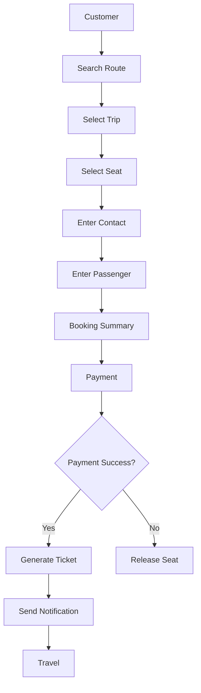

# Business Overview

**Project:** BusZ - Intercity Bus Ticket Booking Platform

**Version:** 1.0

**Document Type:** Business Overview

**Status:** Draft

---

# 1. Purpose

Tài liệu này mô tả tổng quan về nghiệp vụ của hệ thống BusZ.

Mục tiêu của tài liệu là giúp:

- Hiểu cách hệ thống hoạt động.
- Hiểu vai trò của từng người dùng.
- Hiểu quy trình đặt vé.
- Hiểu luồng dữ liệu.
- Làm nền tảng cho Database, Backend và API.

---

# 2. Business Background

Ngành vận tải hành khách liên tỉnh tại Việt Nam đang phát triển nhanh nhưng phần lớn quy trình đặt vé vẫn còn nhiều hạn chế:

- Đặt vé qua điện thoại.
- Đặt vé trực tiếp tại quầy.
- Quản lý danh sách hành khách bằng Excel.
- Không có vé điện tử.
- Không có hệ thống quản lý tập trung.

Điều này gây ra nhiều vấn đề:

- Khó kiểm soát số lượng ghế.
- Dễ bán trùng ghế.
- Khó thống kê doanh thu.
- Mất nhiều thời gian cho khách hàng.
- Không có dữ liệu để phân tích.

BusZ được xây dựng để giải quyết các vấn đề trên.

---

# 3. Business Goals

BusZ hướng đến việc:

- Số hóa quy trình đặt vé.
- Tăng trải nghiệm khách hàng.
- Giảm thao tác thủ công.
- Chuẩn hóa dữ liệu.
- Quản lý tập trung.
- Hỗ trợ nhiều nhà xe trên cùng nền tảng.

---

# 4. Business Model

BusZ đóng vai trò là nền tảng trung gian kết nối giữa khách hàng và các nhà xe.

Luồng hoạt động:

Customer

↓

BusZ Platform

↓

Bus Company

↓

Trip

↓

Booking

↓

Payment

↓

Ticket

↓

Travel

---

# 5. Stakeholders

## Customer

Người sử dụng ứng dụng để:

- Tìm chuyến xe.
- Đặt vé.
- Thanh toán.
- Nhận vé điện tử.
- Đánh giá chuyến đi.

---

## Bus Company

Đơn vị vận hành xe khách.

Có trách nhiệm:

- Cập nhật xe.
- Cập nhật tuyến.
- Cập nhật chuyến.
- Quản lý tài xế.
- Theo dõi doanh thu.

---

## Administrator

Quản trị hệ thống.

Có quyền:

- Quản lý toàn bộ dữ liệu.
- Quản lý người dùng.
- Quản lý nhà xe.
- Quản lý thanh toán.
- Quản lý khuyến mãi.
- Quản lý báo cáo.

---

## System

Hệ thống BusZ tự động:

- Kiểm tra ghế.
- Khóa ghế.
- Mở ghế.
- Gửi thông báo.
- Sinh QR Code.
- Sinh Booking Code.
- Đồng bộ dữ liệu.

---

# 6. Business Workflow

Quy trình nghiệp vụ tổng quát.



---

# 7. Main Business Domains

BusZ được chia thành các Domain chính.

## Authentication

Quản lý tài khoản.

---

## User Management

Quản lý hồ sơ.

Liên hệ.

Hành khách.

---

## Route Management

Quản lý:

- Điểm đi.
- Điểm đến.
- Checkpoint.

---

## Trip Management

Quản lý:

- Chuyến xe.
- Giá.
- Lịch trình.

---

## Seat Management

Quản lý:

- Sơ đồ ghế.
- Trạng thái ghế.
- Ghế đang giữ.
- Ghế đã bán.

---

## Booking Management

Quản lý:

- Booking.
- Booking Item.
- Booking Status.

---

## Payment Management

Quản lý:

- Thanh toán.
- Callback.
- Refund.

---

## Ticket Management

Quản lý:

- Vé điện tử.
- QR Code.
- Kiểm tra vé.

---

## Review Management

Đánh giá nhà xe.

Đánh giá chuyến đi.

---

## Notification Management

Thông báo:

- Booking.
- Payment.
- Promotion.

---

# 8. Business Lifecycle

```text
Search

↓

Trip

↓

Seat

↓

Booking

↓

Payment

↓

Ticket

↓

Travel

↓

Review
```

---

# 9. Business Value

Đối với khách hàng:

- Đặt vé nhanh.
- Không cần đến quầy.
- Có vé điện tử.
- Thanh toán online.

Đối với nhà xe:

- Quản lý tập trung.
- Giảm bán trùng ghế.
- Theo dõi doanh thu.
- Quản lý chuyến.

Đối với BusZ:

- Xây dựng nền tảng đa nhà xe.
- Dễ mở rộng.
- Dễ tích hợp dịch vụ.

---

# 10. Related Documents

Các tài liệu liên quan:

- Project Overview
- Business Rules
- Booking Process
- Payment Process
- Database Design
- Backend Architecture
- API Specification

---

# 11. Summary

Business Overview là tài liệu nền tảng của toàn bộ phần Business.

Các tài liệu tiếp theo sẽ mô tả chi tiết từng quy trình nghiệp vụ như:

- User Roles
- Business Rules
- Booking Process
- Payment Process
- Cancellation Process
- Refund Process
- Notification Process

Tất cả Database, Backend và API sẽ được thiết kế dựa trên các quy trình nghiệp vụ này.