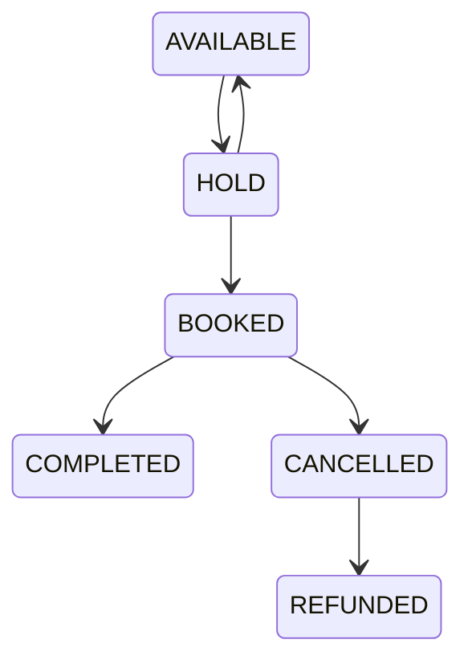
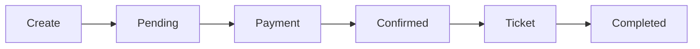

# Business Rules

**Project:** BusZ - Intercity Bus Ticket Booking Platform

**Version:** 1.0

**Document Type:** Business Rules

**Status:** Draft

---

# 1. Purpose

Tài liệu này mô tả toàn bộ quy tắc nghiệp vụ (Business Rules) của hệ thống BusZ.

Business Rules là các quy định bắt buộc mà hệ thống phải tuân thủ.

Tất cả các module như:

- Database
- Backend
- Flutter
- Admin Website
- API

đều phải tuân theo tài liệu này.

---

# 2. Authentication Rules

BR-001

Mỗi Email chỉ được đăng ký một tài khoản.

---

BR-002

Mỗi số điện thoại chỉ được liên kết với một tài khoản.

---

BR-003

Password tối thiểu 8 ký tự.

---

BR-004

Password phải được Hash.

---

BR-005

JWT chỉ có hiệu lực trong thời gian cấu hình.

---

BR-006

Refresh Token phải được lưu trong Database.

---

BR-007

User bị khóa sẽ không thể đăng nhập.

---

# 3. Route Rules

BR-010

Một Route luôn có:

- Departure
- Destination

---

BR-011

Departure và Destination không được giống nhau.

---

BR-012

Một Route có thể có nhiều Checkpoint.

---

BR-013

Một Checkpoint có thể thuộc nhiều Route.

---

# 4. Trip Rules

BR-020

Một Trip chỉ thuộc một Route.

---

BR-021

Một Trip chỉ sử dụng một Bus.

---

BR-022

Một Trip thuộc một Bus Company.

---

BR-023

Trip phải có:

- Departure Time
- Arrival Time

---

BR-024

Arrival Time luôn lớn hơn Departure Time.

---

BR-025

Trip đã hoàn thành không thể chỉnh sửa.

---

# 5. Seat Rules

BR-030

Seat Code phải duy nhất trong cùng một Bus.

---

BR-031

Ghế chỉ có một trạng thái tại một thời điểm.

AVAILABLE

↓

HOLD

↓

BOOKED

↓

COMPLETED

---

BR-032

Ghế HOLD sẽ tự động mở sau thời gian cấu hình.

---

BR-033

Ghế BOOKED không thể được chọn.

---

BR-034

Ghế BLOCKED không hiển thị cho khách.

---

# 6. Booking Rules

BR-040

Booking phải có ít nhất một Passenger.

---

BR-041

Booking phải có Contact.

---

BR-042

Booking phải có Trip.

---

BR-043

Booking chỉ được tạo khi còn ghế.

---

BR-044

Booking Code là duy nhất.

---

BR-045

Booking hết hạn nếu chưa thanh toán.

---

BR-046

Booking đã thanh toán không thể chỉnh sửa.

---

# 7. Passenger Rules

BR-050

Một Passenger có thể được dùng cho nhiều Booking.

---

BR-051

Contact có thể khác Passenger.

---

BR-052

Passenger phải có:

- Full Name
- Phone
- Gender

---

# 8. Payment Rules

BR-060

Payment chỉ được tạo sau khi Booking thành công.

---

BR-061

Một Booking chỉ có một Payment chính.

---

BR-062

Payment thành công sẽ:

- Confirm Booking
- Book Seat
- Generate Ticket

---

BR-063

Payment thất bại sẽ:

- Giữ Booking
- Chờ thanh toán lại

---

BR-064

Payment quá hạn:

Booking

↓

Cancelled

↓

Release Seat

---

# 9. Ticket Rules

BR-070

Ticket chỉ được tạo sau khi Payment thành công.

---

BR-071

Ticket có QR Code duy nhất.

---

BR-072

QR Code chỉ sử dụng một lần khi Check-in.

---

BR-073

Ticket đã sử dụng không thể Check-in lần hai.

---

# 10. Cancellation Rules

BR-080

Chỉ Booking CONFIRMED mới được hủy.

---

BR-081

Không thể hủy sau thời gian quy định.

---

BR-082

Phí hủy phụ thuộc chính sách nhà xe.

---

# 11. Refund Rules

BR-090

Refund chỉ xảy ra sau khi Cancellation được duyệt.

---

BR-091

Refund không vượt quá số tiền thanh toán.

---

BR-092

Refund ghi nhận vào lịch sử giao dịch.

---

# 12. Review Rules

BR-100

Chỉ Passenger đã hoàn thành chuyến đi mới được đánh giá.

---

BR-101

Mỗi Booking chỉ được đánh giá một lần.

---

# 13. Notification Rules

BR-110

Notification được gửi khi:

- Booking Success
- Payment Success
- Cancellation
- Refund
- Promotion

---

# 14. Promotion Rules

BR-120

Coupon có ngày hết hạn.

---

BR-121

Coupon chỉ sử dụng một lần.

---

BR-122

Coupon có thể giới hạn:

- Route
- Bus Company
- User

---

# 15. Admin Rules

BR-130

Admin không thể xóa dữ liệu đã thanh toán.

---

BR-131

Admin phải ghi Audit Log.

---

BR-132

Super Admin mới được tạo Admin.

---

# 16. Business State Flow

---

# 17. Booking Lifecycle

Nếu Payment Fail

Pending

↓

Cancelled

↓

Release Seat

---

# 18. Validation Rules

Email

Unique

Phone

Unique

Booking Code

Unique

QR Code

Unique

Seat Code

Unique

Trip Code

Unique

---

# 19. Exception Rules

Không đủ ghế.

↓

Không tạo Booking.

---

Payment lỗi.

↓

Không tạo Ticket.

---

Trip bị hủy.

↓

Thông báo khách.

↓

Refund.

---

# 20. Summary

Business Rules là tài liệu quan trọng nhất trong toàn bộ dự án BusZ.

Toàn bộ Backend, Database, API, Mobile và Admin Website phải tuân thủ các quy tắc được định nghĩa trong tài liệu này.

Mọi thay đổi nghiệp vụ trong tương lai phải cập nhật tại tài liệu này trước khi triển khai vào hệ thống.