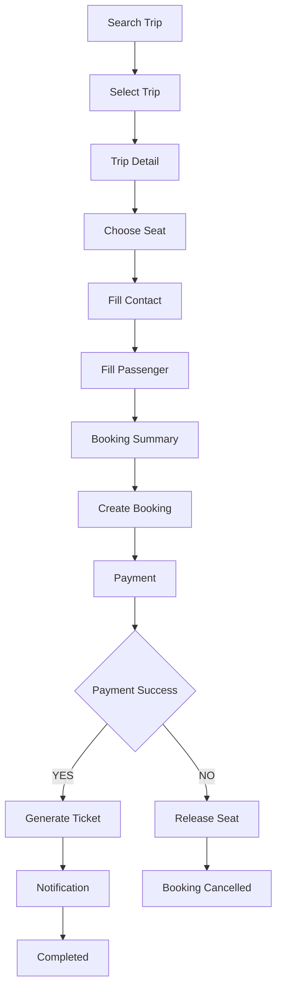
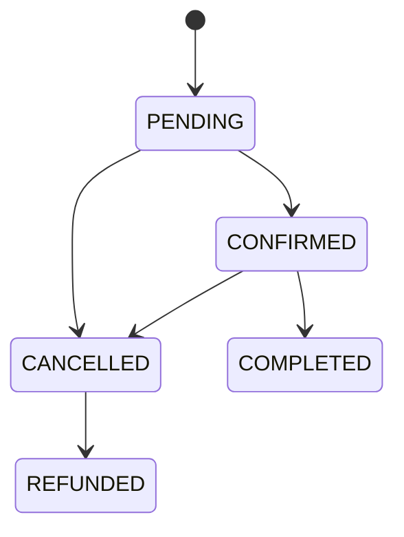

# Booking Process

**Project:** BusZ - Intercity Bus Ticket Booking Platform

Version: 1.0

Status: Draft

Module: Booking

Priority: Critical

---

# 1. Purpose

Booking Process mô tả toàn bộ quy trình đặt vé của BusZ.

Đây là nghiệp vụ quan trọng nhất của hệ thống.

Tất cả các module đều liên quan:

- Authentication
- Search
- Route
- Trip
- Seat
- Passenger
- Payment
- Ticket
- Notification

---

# 2. Business Goal

Cho phép khách hàng:

- tìm chuyến xe
- chọn chuyến
- chọn ghế
- nhập thông tin
- thanh toán
- nhận vé điện tử

một cách nhanh chóng và chính xác.

---

# 3. Actors

Primary

Customer

Secondary

BusZ Backend

Payment Gateway

Notification Service

Admin

Bus Company

---

# 4. Preconditions

Customer đã đăng nhập.

Trip còn hoạt động.

Trip còn ghế.

Payment Gateway hoạt động.

---

# 5. Booking Flow

---

# 6. Detailed Process

## Step 1

Customer mở ứng dụng.

↓

Home.

---

## Step 2

Customer nhập:

Departure

Destination

Date

Passenger Count

↓

Search.

---

## Step 3

Backend

↓

Search Route

↓

Search Trip

↓

Return Trip List.

---

## Step 4

Customer chọn Trip.

↓

Trip Detail.

---

## Step 5

Customer xem:

Gallery

Facilities

Route

Policy

Terms

↓

Continue.

---

## Step 6

Calendar.

↓

Departure Date.

↓

Return Date.

---

## Step 7

Seat Selection.

Customer chọn ghế.

Backend

↓

Lock Seat.

---

## Step 8

Customer nhập:

Contact

Passenger

---

## Step 9

Booking Summary.

Hiển thị:

Trip

Seat

Passenger

Price

Discount

Total

---

## Step 10

Customer nhấn

Book Now

↓

Backend

↓

Create Booking

↓

Status

PENDING

---

## Step 11

Payment.

↓

Payment Gateway.

---

## Step 12

Payment Callback.

Nếu thành công.

↓

Booking

↓

CONFIRMED

↓

Generate Ticket

↓

Generate QR

↓

Send Notification

---

Nếu thất bại.

↓

Booking

↓

FAILED

↓

Release Seat

---

# 7. Booking State

---

# 8. Database Tables

users

contacts

passengers

routes

trips

seats

bookings

booking_items

payments

tickets

notifications

---

# 9. API Sequence

GET

/trips/search

↓

GET

/trips/{id}

↓

GET

/trips/{id}/seats

↓

POST

/bookings

↓

POST

/payments/create

↓

POST

/payments/callback

↓

GET

/tickets/{bookingCode}

---

# 10. Validation

Trip tồn tại.

Seat còn trống.

Passenger hợp lệ.

Contact hợp lệ.

Booking chưa tồn tại.

Payment hợp lệ.

---

# 11. Exception Cases

Không còn ghế.

↓

Thông báo.

↓

Quay lại Seat.

---

Payment Fail.

↓

Booking Failed.

↓

Release Seat.

---

Trip Cancelled.

↓

Refund.

↓

Notification.

---

Internet Lost.

↓

Retry.

↓

Continue.

---

# 12. Business Rules

Không được:

Booking

↓

Seat đã BOOKED.

---

Không được:

Thanh toán

↓

Booking không tồn tại.

---

Không được:

Sinh Ticket

↓

Payment FAILED.

---

# 13. UI Mapping

Search

↓

Trip List

↓

Trip Detail

↓

Calendar

↓

Seat

↓

Passenger

↓

Booking Summary

↓

Payment

↓

Payment Success

↓

Ticket

---

# 14. Security

JWT

↓

Booking

↓

Verify Owner

↓

Create Booking.

---

Không cho phép:

Booking của User khác.

---

# 15. Notification

Booking Success.

↓

Push Notification.

↓

Email.

↓

History.

---

# 16. Logging

Create Booking.

Payment.

Ticket.

Refund.

Notification.

---

# 17. Acceptance Criteria

✓ User tìm được chuyến xe.

✓ Chọn được ghế.

✓ Booking thành công.

✓ Thanh toán thành công.

✓ Nhận QR Ticket.

✓ Ghế chuyển sang BOOKED.

✓ Notification được gửi.

---

# 18. Future Expansion

Group Booking

Corporate Booking

Seat Recommendation

AI Seat Suggestion

Insurance

Travel Package

Coupon Engine

Membership

---

# 19. Related Documents

Business Rules

Payment Process

Refund Process

Database Design

Backend Architecture

API Specification

---

# 20. Summary

Booking Process là tài liệu nghiệp vụ quan trọng nhất của BusZ.

Tất cả Database, Backend, API, Flutter và Website Admin đều phải tuân theo quy trình này nhằm đảm bảo hệ thống hoạt động nhất quán và tránh phát sinh lỗi trong quá trình đặt vé.