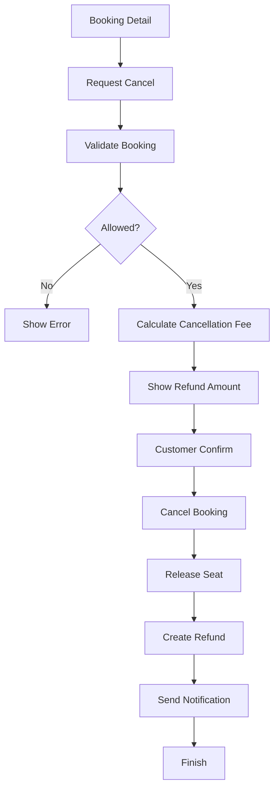
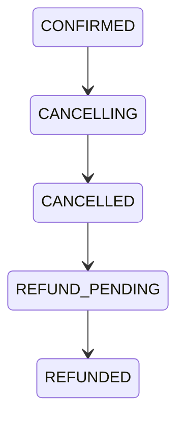

# Cancellation Process

**Project:** BusZ - Intercity Bus Ticket Booking Platform

Version: 1.0

Document Type: Business Process

Module: Cancellation

Priority: High

Status: Draft

---

# 1. Purpose

Tài liệu này mô tả toàn bộ quy trình hủy vé (Cancellation Process) trong hệ thống BusZ.

Quy trình bao gồm:

- Người dùng yêu cầu hủy vé.
- Kiểm tra điều kiện hủy.
- Tính phí hủy.
- Hoàn ghế.
- Hoàn tiền (nếu có).
- Cập nhật trạng thái.
- Gửi thông báo.

Tài liệu này là nền tảng để thiết kế:

- Database
- Backend
- Payment
- Refund
- Notification
- Admin

---

# 2. Business Goal

Đảm bảo việc hủy vé:

- Chính xác.
- Minh bạch.
- Không gây mất dữ liệu.
- Không bán trùng ghế.
- Tuân theo chính sách của nhà xe.

---

# 3. Actors

Primary

- Customer

Secondary

- Backend
- Payment Gateway
- Notification Service
- Bus Company
- Admin

---

# 4. Preconditions

Customer đã đăng nhập.

Booking tồn tại.

Booking thuộc Customer.

Booking chưa hoàn thành.

Booking chưa bị hủy.

---

# 5. Cancellation Flow

---

# 6. Detailed Process

## Step 1

Customer mở:

Booking Detail

↓

Nhấn

Cancel Booking

---

## Step 2

Backend kiểm tra:

- Booking tồn tại.
- User là chủ Booking.
- Booking chưa hủy.
- Trip chưa khởi hành.

---

## Step 3

Kiểm tra chính sách nhà xe.

Ví dụ:

- Không được hủy.
- Hoàn 100%.
- Hoàn 80%.
- Hoàn 50%.
- Không hoàn tiền.

---

## Step 4

Hiển thị:

- Phí hủy.
- Số tiền hoàn.
- Điều khoản.

---

## Step 5

Customer xác nhận.

---

## Step 6

Backend cập nhật:

Booking

↓

CANCELLED

---

## Step 7

Release Seat.

Ghế chuyển:

BOOKED

↓

AVAILABLE

---

## Step 8

Nếu có Refund.

↓

Tạo Refund Request.

---

## Step 9

Notification.

↓

Push

↓

Email

↓

History

---

# 7. Cancellation State

---

# 8. Cancellation Policy

## Policy A

Hủy trước 48 giờ.

↓

Hoàn 100%

---

## Policy B

24 - 48 giờ.

↓

Hoàn 80%

---

## Policy C

6 - 24 giờ.

↓

Hoàn 50%

---

## Policy D

< 6 giờ.

↓

Không hoàn tiền.

---

# 9. Database Impact

Affected Tables

bookings

booking_items

payments

refunds

tickets

notifications

activity_logs

---

# 10. Booking Status

PENDING

↓

CONFIRMED

↓

CANCELLED

↓

REFUNDED

---

# 11. Seat Status

BOOKED

↓

AVAILABLE

---

# 12. Ticket Status

ACTIVE

↓

CANCELLED

---

# 13. Refund Status

PENDING

↓

PROCESSING

↓

SUCCESS

↓

FAILED

---

# 14. API Flow

GET

/bookings/{id}

↓

POST

/bookings/{id}/cancel

↓

POST

/refunds

↓

GET

/refunds/{id}

---

# 15. Validation

Booking tồn tại.

Booking thuộc User.

Booking chưa khởi hành.

Booking chưa hủy.

---

# 16. Exception Cases

Trip đã khởi hành.

↓

Không được hủy.

---

Booking không tồn tại.

↓

404

---

Refund thất bại.

↓

Retry.

↓

Admin xử lý.

---

# 17. Notification

Customer

↓

Booking Cancelled

↓

Refund Processing

↓

Refund Success

---

Admin

↓

Cancellation Created

---

Bus Company

↓

Seat Released

---

# 18. Logging

Cancellation Request

Refund Request

Seat Release

Notification

Audit Log

---

# 19. Acceptance Criteria

✓ Booking được hủy.

✓ Ghế được mở lại.

✓ Ticket bị vô hiệu.

✓ Refund được tạo.

✓ Notification được gửi.

✓ Activity Log được ghi.

---

# 20. Future Expansion

- Auto Cancellation
- Cancellation Insurance
- Flexible Ticket
- Partial Cancellation
- Group Cancellation
- AI Refund Prediction

---

# 21. Related Documents

- Booking Process
- Refund Process
- Payment Process
- Business Rules
- Database Design
- API Specification

---

# 22. Summary

Cancellation Process đảm bảo mọi thao tác hủy vé đều được kiểm soát chặt chẽ, tuân theo chính sách nhà xe, đồng thời đồng bộ trạng thái giữa Booking, Seat, Payment, Ticket và Refund để đảm bảo tính toàn vẹn dữ liệu và trải nghiệm người dùng.