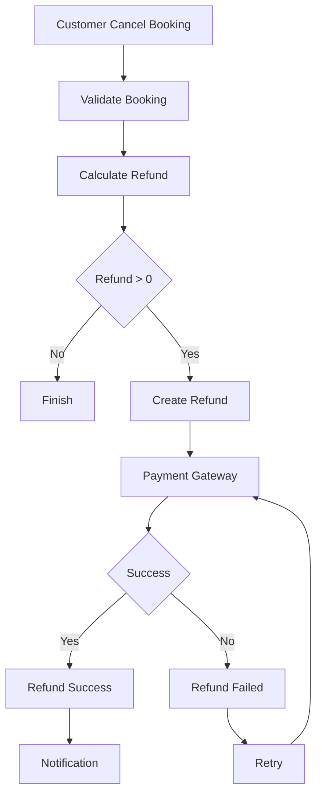
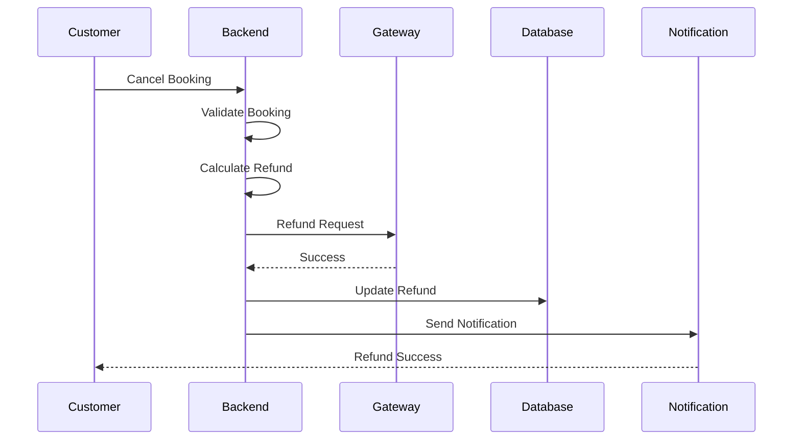

# Refund Process

**Project:** BusZ - Intercity Bus Ticket Booking Platform

Version: 1.0

Document Type: Business Process

Module: Refund

Priority: High

Status: Draft

---

# 1. Purpose

Tài liệu này mô tả toàn bộ quy trình hoàn tiền (Refund Process) của hệ thống BusZ.

Refund Process đảm bảo:

- Hoàn tiền chính xác.
- Không hoàn tiền trùng.
- Theo đúng chính sách nhà xe.
- Đồng bộ giữa Booking, Payment và Ticket.
- Có khả năng kiểm tra và truy vết.

Đây là tài liệu nền tảng để thiết kế:

- Refund Module
- Payment Module
- Notification Module
- Database
- Admin Website

---

# 2. Business Goal

Mục tiêu của Refund Process:

- Xử lý hoàn tiền tự động.
- Hạn chế thao tác thủ công.
- Giảm tranh chấp.
- Tăng sự minh bạch.
- Đảm bảo tính toàn vẹn dữ liệu.

---

# 3. Actors

Primary

Customer

Secondary

Payment Gateway

BusZ Backend

Admin

Bus Company

Notification Service

---

# 4. Refund Conditions

Refund chỉ được tạo khi:

✓ Booking đã thanh toán.

✓ Booking đã bị hủy.

✓ Booking đủ điều kiện hoàn tiền.

✓ Không tồn tại Refund khác.

---

# 5. Refund Flow



---

# 6. Detailed Process

## Step 1

Customer yêu cầu hủy vé.

---

## Step 2

Backend kiểm tra:

Booking Status

Payment Status

Cancellation Policy

Refund Policy

---

## Step 3

Tính số tiền hoàn.

Refund Amount

=

Paid Amount

-

Cancellation Fee

---

## Step 4

Tạo Refund Request.

Status

PENDING

---

## Step 5

Gửi yêu cầu sang Payment Gateway.

---

## Step 6

Gateway trả kết quả.

SUCCESS

FAILED

PROCESSING

---

## Step 7

Nếu SUCCESS

↓

Booking

↓

REFUNDED

↓

Notification

---

## Step 8

Nếu FAILED

↓

Retry

↓

Admin Review

---

# 7. Refund State

```mermaid
stateDiagram-v2

PENDING

-->

PROCESSING

PROCESSING

-->

SUCCESS

PROCESSING

-->

FAILED

FAILED

-->

RETRY

RETRY

-->

SUCCESS
```

---

# 8. Refund Policy

## Policy 1

> 48 giờ

Refund

100%

---

## Policy 2

24 - 48 giờ

Refund

80%

---

## Policy 3

6 - 24 giờ

Refund

50%

---

## Policy 4

< 6 giờ

Refund

0%

---

# 9. Refund Formula

Refund Amount

=

Paid Amount

-

Cancellation Fee

---

Ví dụ

Paid

500.000

Fee

100.000

Refund

400.000

---

# 10. Refund Status

PENDING

PROCESSING

SUCCESS

FAILED

CANCELLED

EXPIRED

---

# 11. Database Tables

refunds

refund_items

payments

payment_transactions

bookings

tickets

activity_logs

notifications

---

# 12. Database Changes

Booking

↓

REFUNDED

Payment

↓

REFUND_SUCCESS

Ticket

↓

INVALID

Seat

↓

AVAILABLE

---

# 13. Payment Gateway

Supported

VNPay

MoMo

ZaloPay

Future

Stripe

PayPal

Apple Pay

Google Pay

---

# 14. Validation Rules

Refund chỉ thực hiện một lần.

Refund Amount

>= 0

Refund Amount

<= Paid Amount

Booking phải thuộc User.

Payment phải SUCCESS.

---

# 15. Exception Cases

Booking chưa thanh toán.

↓

Không Refund.

---

Booking đã Refund.

↓

Không Refund.

---

Gateway Timeout.

↓

Retry.

---

Gateway Offline.

↓

Queue.

---

# 16. Retry Strategy

Retry

1 phút

↓

5 phút

↓

30 phút

↓

2 giờ

↓

Manual Review

---

# 17. Notification

Customer

Refund Created

Refund Processing

Refund Success

Refund Failed

---

Admin

Refund Failed

Manual Review

---

Bus Company

Booking Refunded

---

# 18. Logging

Refund Created

Refund Updated

Refund Success

Refund Failed

Gateway Callback

Admin Action

---

# 19. Audit Trail

Lưu:

Created By

Approved By

Gateway Transaction ID

Refund Amount

Refund Time

Reason

---

# 20. Security

Refund API

↓

JWT

↓

Permission

↓

Transaction Lock

↓

Gateway

---

# 21. Sequence Diagram



---

# 22. Acceptance Criteria

✓ Refund chỉ tạo một lần.

✓ Không hoàn tiền vượt quá số tiền đã thanh toán.

✓ Booking chuyển REFUNDED.

✓ Ticket vô hiệu.

✓ Ghế được mở lại.

✓ Notification được gửi.

✓ Activity Log được ghi.

---

# 23. Future Expansion

Partial Refund

Automatic Refund

Insurance Refund

Voucher Refund

Wallet Refund

Reward Point Refund

---

# 24. Related Documents

Booking Process

Cancellation Process

Payment Process

Business Rules

API Specification

Database Design

---

# 25. Summary

Refund Process đảm bảo toàn bộ quá trình hoàn tiền trong BusZ được xử lý an toàn, minh bạch và nhất quán.

Hệ thống phải đồng bộ trạng thái giữa Booking, Payment, Ticket, Seat và Notification để tránh mất dữ liệu hoặc hoàn tiền sai.