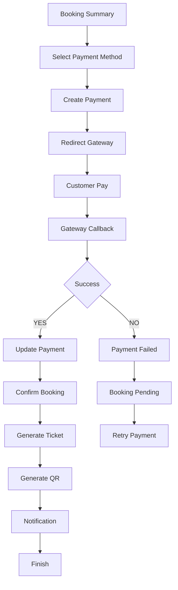

# Payment Process

Project: BusZ - Intercity Bus Ticket Booking Platform

Version: 1.0

Module: Payment

Priority: Critical

Status: Draft

---

# 1. Purpose

Tài liệu này mô tả toàn bộ quy trình thanh toán của hệ thống BusZ.

Đây là module chịu trách nhiệm:

- Thanh toán đơn đặt vé
- Xác nhận giao dịch
- Đồng bộ Booking
- Sinh Ticket
- Gửi Notification
- Lưu Transaction
- Hỗ trợ Refund

---

# 2. Business Goal

Đảm bảo quá trình thanh toán:

- Chính xác
- An toàn
- Không thanh toán trùng
- Không sinh Ticket sai
- Không mất dữ liệu

---

# 3. Actors

Primary

Customer

Secondary

Backend

Payment Gateway

Notification Service

Ticket Service

Admin

Bus Company

---

# 4. Supported Payment Methods

Version 1

- VNPay
- MoMo
- ZaloPay

Future

- Visa
- Mastercard
- Apple Pay
- Google Pay
- Stripe
- PayPal

---

# 5. Preconditions

Booking tồn tại.

Booking Status = PENDING

Ghế đang HOLD.

Payment Gateway hoạt động.

JWT hợp lệ.

---

# 6. Payment Flow



---

# 7. Detailed Process

## Step 1

Customer nhấn

Pay Now

---

## Step 2

Backend

↓

Create Payment

↓

Payment Status

PENDING

---

## Step 3

Backend

↓

Generate Payment URL

↓

Return URL

---

## Step 4

Flutter

↓

Open Payment Gateway

---

## Step 5

Customer xác nhận thanh toán.

---

## Step 6

Gateway xử lý.

---

## Step 7

Gateway Callback.

↓

Backend Verify Signature.

---

## Step 8

Nếu Signature hợp lệ.

↓

Update Payment.

---

## Step 9

Payment

SUCCESS

↓

Booking

CONFIRMED

↓

Seat

BOOKED

↓

Generate Ticket

↓

Generate QR

↓

Notification

---

## Step 10

Nếu FAIL.

↓

Payment

FAILED

↓

Booking

PENDING

↓

Retry

---

# 8. Payment State

```mermaid
stateDiagram-v2

PENDING

-->

PROCESSING

PROCESSING

-->

SUCCESS

PROCESSING

-->

FAILED

FAILED

-->

RETRY

RETRY

-->

SUCCESS

FAILED

-->

CANCELLED
```

---

# 9. Booking State

PENDING

↓

CONFIRMED

↓

COMPLETED

---

Nếu Payment FAIL

↓

PENDING

---

Nếu Timeout

↓

CANCELLED

---

# 10. Database Tables

payments

payment_transactions

bookings

booking_items

tickets

notifications

activity_logs

refunds

---

# 11. Database Updates

Payment

SUCCESS

Booking

CONFIRMED

Seat

BOOKED

Ticket

ACTIVE

Notification

CREATED

---

# 12. API Flow

POST

/payments/create

↓

GET

/payments/{id}

↓

POST

/payments/callback

↓

POST

/payments/verify

↓

GET

/payments/history

---

# 13. Validation Rules

Booking tồn tại.

Booking chưa thanh toán.

Booking thuộc User.

Payment Amount > 0.

Currency hợp lệ.

Signature hợp lệ.

---

# 14. Signature Verification

Gateway

↓

Signature

↓

Backend Verify

↓

Accept

hoặc

Reject

Không cập nhật Database nếu Signature không hợp lệ.

---

# 15. Idempotency

Một Callback chỉ được xử lý một lần.

Nếu Gateway gửi Callback nhiều lần.

↓

Backend bỏ qua.

Không tạo Ticket lần hai.

Không cập nhật Payment lần hai.

---

# 16. Timeout

Gateway Timeout

↓

Retry

---

Customer đóng App

↓

Booking giữ nguyên.

---

Booking quá thời gian

↓

Auto Cancel.

↓

Release Seat.

---

# 17. Exception Cases

Gateway Offline.

↓

Retry.

---

Internet Lost.

↓

Retry.

---

Booking Not Found.

↓

404.

---

Payment Expired.

↓

Cancel Booking.

---

# 18. Notification

Payment Created.

Payment Success.

Payment Failed.

Payment Expired.

---

# 19. Logging

Create Payment

Verify Signature

Callback

Generate Ticket

Payment Success

Payment Failed

Retry

Refund

---

# 20. Audit Trail

Payment ID

Gateway Transaction

Amount

Method

Created Time

Updated Time

User

Booking

---

# 21. Security

HTTPS

JWT

Rate Limiting

Transaction Lock

Signature Verify

Replay Protection

Input Validation

---

# 22. Acceptance Criteria

✓ Không thanh toán trùng.

✓ Không tạo Ticket trùng.

✓ Signature hợp lệ.

✓ Booking CONFIRMED.

✓ Seat BOOKED.

✓ Notification gửi thành công.

✓ Activity Log được tạo.

---

# 23. Related Database

payments

payment_transactions

bookings

booking_items

tickets

refunds

notifications

---

# 24. Related Documents

Booking Process

Refund Process

Business Rules

API Specification

Database Design

---

# 25. Future Expansion

Apple Pay

Google Pay

PayPal

Stripe

Split Payment

Wallet

Installment

Crypto

Reward Point Payment

---

# 26. Summary

Payment Process là module quan trọng nhất sau Booking.

Module này đảm bảo:

- Thanh toán chính xác.
- Đồng bộ dữ liệu.
- Sinh vé điện tử.
- Không xử lý giao dịch trùng.
- Đảm bảo an toàn và khả năng mở rộng.