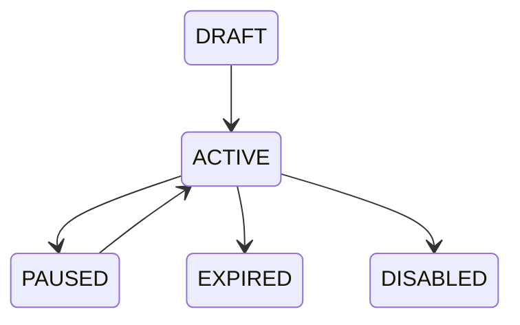

# Promotion Process

**Project:** BusZ - Intercity Bus Ticket Booking Platform

Version: 1.0

Document Type: Business Process

Module: Promotion

Priority: Medium

Status: Draft

---

# 1. Purpose

Tài liệu này mô tả toàn bộ quy trình quản lý và áp dụng chương trình khuyến mãi trong hệ thống BusZ.

Promotion giúp:

- Thu hút khách hàng mới.
- Tăng tỷ lệ đặt vé.
- Khuyến khích khách hàng quay lại.
- Hỗ trợ các chiến dịch Marketing.
- Tăng doanh thu cho nhà xe.

Promotion phải hoạt động độc lập với Booking nhưng có thể tích hợp với Loyalty Points và Payment.

---

# 2. Scope

Áp dụng cho:

- Mobile Application
- Backend
- Admin Website
- Payment Module
- Booking Module

---

# 3. Actors

Primary

Customer

Secondary

Backend

Promotion Service

Admin

Bus Company

Payment Gateway

---

# 4. Promotion Types

Version 1 hỗ trợ:

Percentage Discount

Ví dụ:

10%

20%

30%

---

Fixed Discount

Ví dụ:

20.000 VNĐ

50.000 VNĐ

100.000 VNĐ

---

Voucher Code

Ví dụ:

WELCOME50

BUSZ10

SUMMER2026

---

Free Shipping

Không áp dụng trong Version 1.

---

Future

Flash Sale

Combo

Buy One Get One

Student Discount

Birthday Promotion

Membership Promotion

---

# 5. Promotion Lifecycle



---

# 6. Promotion Flow

```mermaid
flowchart TD

Customer

↓

Booking Summary

↓

Enter Coupon

↓

Backend Validate

↓

Promotion Service

↓

Valid ?

↓

YES

↓

Calculate Discount

↓

Update Booking

↓

Continue Payment

NO

↓

Show Error
```

---

# 7. Promotion Conditions

Promotion có thể giới hạn:

Bus Company

Route

Trip

Date

Booking Amount

Membership

First Booking

Specific User

Promotion Period

---

Ví dụ

Promotion chỉ áp dụng:

TP.HCM

↓

Đà Lạt

↓

Trong tháng 7

↓

Giảm 20%

---

# 8. Coupon Validation

Backend kiểm tra:

Coupon tồn tại.

Coupon chưa hết hạn.

Coupon chưa vượt số lượt sử dụng.

Coupon thuộc User (nếu có).

Booking đủ điều kiện.

Promotion đang ACTIVE.

---

# 9. Discount Calculation

Discount

=

Min

(

Promotion Limit,

Booking Total × Promotion %

)

---

Ví dụ

Booking

500.000

Promotion

20%

↓

Discount

100.000

---

Maximum Discount

50.000

↓

Final Discount

50.000

---

# 10. Database Tables

promotions

promotion_conditions

promotion_routes

promotion_bus_companies

promotion_users

promotion_usage

coupons

coupon_redemptions

bookings

---

# 11. Promotion Status

DRAFT

ACTIVE

PAUSED

EXPIRED

DISABLED

---

# 12. Coupon Status

NEW

USED

EXPIRED

LOCKED

CANCELLED

---

# 13. Business Rules

Promotion không được:

Giảm lớn hơn tổng tiền.

---

Một Coupon

↓

Chỉ sử dụng một lần.

---

Promotion hết hạn

↓

Không áp dụng.

---

Refund

↓

Không hoàn Coupon.

(Future có thể thay đổi.)

---

# 14. Validation Rules

Promotion Date hợp lệ.

Discount > 0.

Maximum Discount > 0.

Booking đạt Minimum Amount.

Coupon chưa dùng.

---

# 15. Exception Cases

Coupon không tồn tại.

↓

Thông báo lỗi.

---

Coupon hết hạn.

↓

Thông báo.

---

Promotion bị Pause.

↓

Không áp dụng.

---

Promotion đạt giới hạn.

↓

Không áp dụng.

---

# 16. Notification

Promotion Created

Promotion Updated

Promotion Expired

Coupon Used

Special Promotion

---

# 17. Admin Features

Admin có thể:

Create Promotion

Update Promotion

Pause Promotion

Delete Promotion

Assign Coupon

View Usage

View Statistics

---

# 18. Reports

Promotion Revenue

Coupon Usage

Top Promotion

Promotion Conversion

Discount Amount

Booking Increase

---

# 19. Security

Promotion chỉ được tạo bởi:

Admin

Super Admin

Manager (nếu được cấp quyền)

Coupon Generation phải:

Random

Unique

Không đoán được.

---

# 20. Logging

Promotion Created

Promotion Updated

Promotion Deleted

Coupon Redeemed

Coupon Expired

Admin Action

---

# 21. Audit Trail

Promotion ID

Coupon Code

User

Booking

Discount

Operator

Time

IP Address

---

# 22. Acceptance Criteria

✓ Promotion hợp lệ.

✓ Discount tính chính xác.

✓ Booking cập nhật tổng tiền.

✓ Coupon không sử dụng lần hai.

✓ Promotion Log được ghi.

---

# 23. Related APIs

GET /promotions

GET /promotions/{id}

POST /coupons/validate

POST /coupons/redeem

GET /promotions/history

---

# 24. Related Documents

Business Rules

Booking Process

Payment Process

Loyalty Points

Database Design

API Specification

---

# 25. Future Expansion

Flash Sale

Lucky Draw

Referral Promotion

Membership Promotion

AI Promotion

Campaign Management

Marketing Automation

---

# 26. Summary

Promotion Process chịu trách nhiệm quản lý toàn bộ chương trình khuyến mãi của BusZ.

Module này phải đảm bảo tính chính xác của giảm giá, ngăn chặn gian lận và đồng bộ với Booking, Payment, Loyalty Points và Notification để mang lại trải nghiệm tốt nhất cho khách hàng.