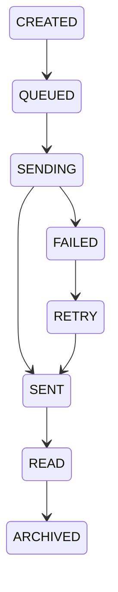

# Notification Process

Project: BusZ - Intercity Bus Ticket Booking Platform

Version: 1.0

Module: Notification

Priority: High

Status: Draft

---

# 1. Purpose

Tài liệu này mô tả toàn bộ hệ thống thông báo (Notification System) của BusZ.

Notification giúp:

- Thông báo trạng thái Booking.
- Thông báo Payment.
- Thông báo Refund.
- Thông báo Promotion.
- Nhắc nhở chuyến đi.
- Thông báo hệ thống.

Notification phải hoạt động tự động, chính xác và không gửi trùng.

---

# 2. Scope

Notification áp dụng cho:

- Flutter Mobile
- Backend
- Admin Website
- Email
- Push Notification
- SMS (Future)

---

# 3. Actors

Primary

Customer

Secondary

Backend

Notification Service

Firebase Cloud Messaging

Email Service

Admin

Bus Company

---

# 4. Notification Channels

Version 1

✓ Push Notification

✓ In-App Notification

Future

Email

SMS

Zalo OA

Telegram

WhatsApp

---

# 5. Notification Types

Booking

Payment

Refund

Promotion

Trip Reminder

Trip Delay

Trip Cancelled

System Announcement

Review Reminder

Membership Upgrade

Point Earned

Point Expired

---

# 6. Notification Lifecycle



---

# 7. Notification Flow

```mermaid
flowchart TD

Business Event

↓

Notification Service

↓

Create Notification

↓

Save Database

↓

Push Queue

↓

Firebase

↓

Customer

↓

Read Notification
```

---

# 8. Business Events

Notification được tạo khi:

User Register

Login From New Device

Booking Created

Booking Confirmed

Payment Success

Payment Failed

Refund Success

Trip Cancelled

Trip Delayed

Promotion Created

Membership Upgraded

Reward Point Added

Review Reminder

---

# 9. Notification Priority

LOW

MEDIUM

HIGH

URGENT

Ví dụ

Payment Success

HIGH

Trip Cancelled

URGENT

Promotion

LOW

---

# 10. Notification Status

CREATED

QUEUED

SENDING

SENT

FAILED

READ

ARCHIVED

---

# 11. Notification Categories

Booking

Payment

Refund

Promotion

Trip

System

Membership

Security

---

# 12. Database Tables

notifications

notification_templates

notification_logs

users

bookings

payments

refunds

promotions

---

# 13. Notification Template

Template bao gồm:

Title

Message

Image

Action

Deep Link

Priority

Language

---

Ví dụ

Title

Payment Successful

Message

Your booking has been confirmed.

Action

Open Ticket

---

# 14. Retry Strategy

Retry

1 phút

↓

5 phút

↓

30 phút

↓

2 giờ

↓

Manual Review

---

# 15. Delivery Rules

Không gửi Notification trùng.

Không gửi User bị khóa.

Không gửi Notification đã hết hạn.

Push thất bại

↓

Retry

---

# 16. Read Rules

Customer mở Notification.

↓

Status

READ

---

Customer xóa.

↓

ARCHIVED

---

# 17. Notification Settings

User có thể bật/tắt:

Promotion

Booking

Payment

Reminder

System

Marketing

---

# 18. Admin Features

Create Notification

Broadcast Notification

Schedule Notification

Delete Notification

View Delivery Report

Retry Failed Notification

---

# 19. Security

Notification phải thuộc User.

Không gửi thông tin nhạy cảm.

Không chứa Password.

Không chứa Token.

---

# 20. Logging

Notification Created

Notification Sent

Notification Failed

Notification Read

Notification Deleted

---

# 21. Audit Trail

Notification ID

User

Template

Channel

Status

Created Time

Read Time

Retry Count

---

# 22. Exception Cases

Firebase Offline

↓

Retry

---

User Offline

↓

Queue

---

Template Missing

↓

Default Template

---

# 23. Acceptance Criteria

✓ Notification được tạo.

✓ Notification lưu Database.

✓ Push thành công.

✓ Không gửi trùng.

✓ Read Status cập nhật.

✓ Log được ghi.

---

# 24. Related APIs

GET /notifications

GET /notifications/{id}

PUT /notifications/read

DELETE /notifications/{id}

POST /notifications/send

---

# 25. Related Documents

Booking Process

Payment Process

Refund Process

Promotion Process

Loyalty Points

Database Design

API Specification

---

# 26. Future Expansion

Email Notification

SMS Notification

Scheduled Notification

AI Notification

Location Based Notification

Marketing Campaign

Realtime Notification Center

---

# 27. Summary

Notification Process là module chịu trách nhiệm gửi và quản lý toàn bộ thông báo trong hệ thống BusZ.

Module này phải đảm bảo:

- Đúng người nhận.
- Đúng thời điểm.
- Không gửi trùng.
- Có khả năng retry.
- Có thể mở rộng nhiều kênh gửi trong tương lai.