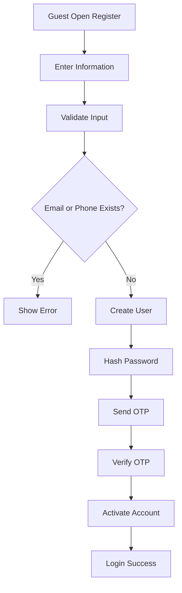
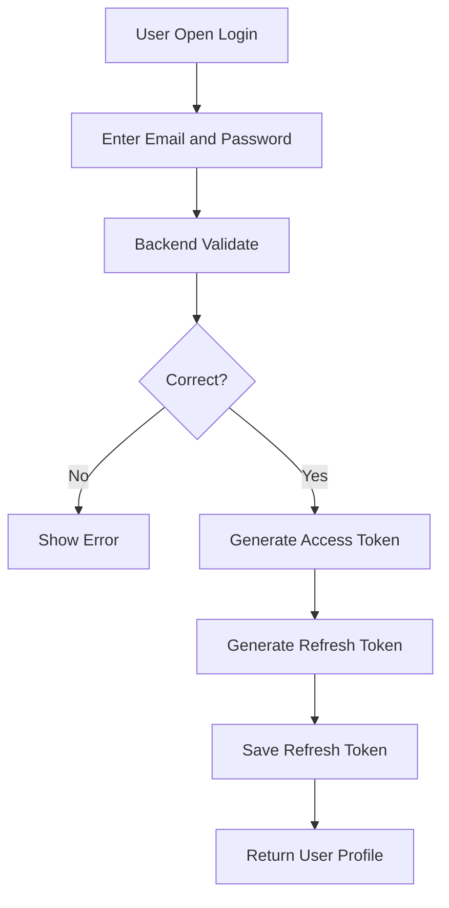
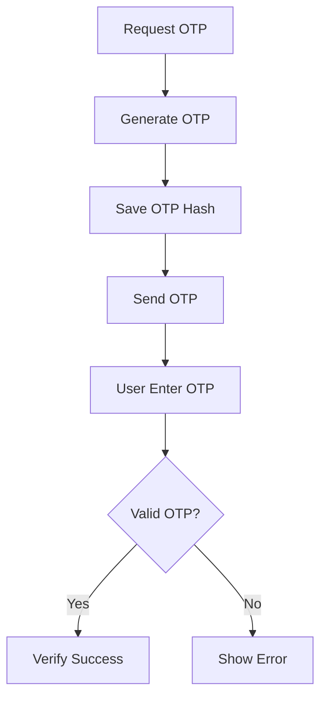
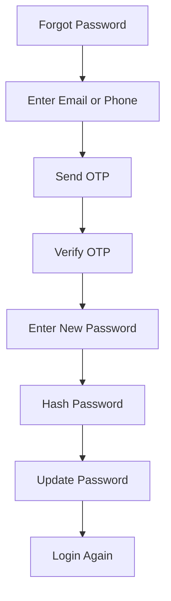

# Authentication Process

Project: BusZ - Intercity Bus Ticket Booking Platform

Version: 1.0

Module: Authentication

Priority: Critical

Status: Draft

---

# 1. Purpose

Tài liệu này mô tả toàn bộ quy trình xác thực người dùng trong hệ thống BusZ.

Authentication chịu trách nhiệm:

- Đăng ký tài khoản
- Đăng nhập
- Đăng xuất
- Quên mật khẩu
- Xác thực OTP
- Làm mới token
- Bảo vệ API
- Quản lý phiên đăng nhập

---

# 2. Scope

Áp dụng cho:

- Mobile App
- Admin Website
- Backend API
- Database
- Notification Service

---

# 3. Actors

Primary:

- Guest
- Customer
- Admin
- Staff

Secondary:

- Backend
- Database
- Email Service
- SMS Service
- Firebase Notification

---

# 4. Authentication Methods

Version 1 hỗ trợ:

- Email + Password
- Phone + OTP
- Refresh Token

Future:

- Google Login
- Apple Login
- Facebook Login
- Biometric Login
- Passkey

---

# 5. Register Flow

---

# 6. Login Flow

---

# 7. OTP Flow

---

# 8. Forgot Password Flow

---

# 9. Logout Flow

User nhấn Logout.

Backend sẽ:

- Thu hồi Refresh Token.
- Xóa session hiện tại.
- Ghi activity log.
- Trả trạng thái logout thành công.

---

# 10. Token Rules

Access Token:

- Thời gian sống ngắn.
- Dùng để gọi API.
- Không lưu trong database.

Refresh Token:

- Thời gian sống dài hơn.
- Lưu trong database.
- Có thể thu hồi.
- Mỗi thiết bị có một refresh token riêng.

---

# 11. Password Rules

Password phải:

- Tối thiểu 8 ký tự.
- Không lưu plain text.
- Hash bằng BCrypt.
- Có thể reset bằng OTP.

---

# 12. Account Status

User có các trạng thái:

- PENDING_VERIFICATION
- ACTIVE
- INACTIVE
- BANNED
- DELETED

---

# 13. Security Rules

Không trả lỗi quá chi tiết.

Ví dụ không nên trả:

Email không tồn tại.

Nên trả:

Thông tin đăng nhập không hợp lệ.

---

Chống brute force:

- Giới hạn số lần login sai.
- Rate limit OTP.
- Khóa tạm thời nếu nhập sai nhiều lần.

---

# 14. Database Tables

Liên quan:

- users
- roles
- permissions
- user_roles
- refresh_tokens
- otp_codes
- login_sessions
- activity_logs

---

# 15. API Impact

Authentication APIs:

- POST /auth/register
- POST /auth/login
- POST /auth/logout
- POST /auth/refresh-token
- POST /auth/send-otp
- POST /auth/verify-otp
- POST /auth/forgot-password
- POST /auth/reset-password

---

# 16. UI Mapping

Các màn hình liên quan:

- Splash Screen
- Onboarding
- Login
- Register
- OTP Verification
- Forgot Password
- Reset Password
- Profile
- Change Password

---

# 17. Exception Cases

Email đã tồn tại.

Phone đã tồn tại.

Password sai.

OTP sai.

OTP hết hạn.

User bị khóa.

Refresh Token hết hạn.

---

# 18. Acceptance Criteria

✓ User đăng ký thành công.

✓ Password được hash.

✓ OTP được gửi.

✓ Login trả Access Token.

✓ Refresh Token được lưu.

✓ Logout thu hồi Token.

✓ User bị khóa không thể đăng nhập.

✓ Activity Log được ghi.

---

# 19. Future Expansion

- Google Login
- Apple Login
- Biometric
- Passkey
- Device Management
- Login Alert
- Two Factor Authentication

---

# 20. Summary

Authentication Process là lớp bảo vệ đầu tiên của BusZ.

Mọi API quan trọng như Booking, Payment, Ticket, Profile và Admin đều phải được bảo vệ bởi Authentication và Authorization.