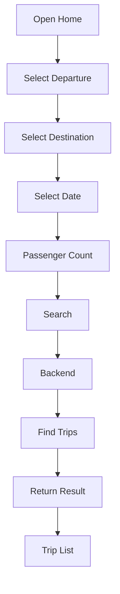

# Search Process

**Project:** BusZ - Intercity Bus Ticket Booking Platform

Version: 1.0

Document Type: Business Process

Module: Search

Priority: Critical

Status: Draft

---

# 1. Purpose

Tài liệu này mô tả toàn bộ quy trình tìm kiếm chuyến xe trong hệ thống BusZ.

Search là chức năng được sử dụng nhiều nhất trong ứng dụng và là điểm bắt đầu của mọi Booking.

Mục tiêu:

- Tìm chuyến xe nhanh.
- Hiển thị chính xác.
- Hỗ trợ lọc.
- Hỗ trợ sắp xếp.
- Hỗ trợ tìm kiếm theo nhiều tiêu chí.

---

# 2. Scope

Áp dụng cho:

- Mobile Application
- Backend API
- Database
- Search Service

---

# 3. Actors

Primary

Customer

Guest

Secondary

Backend

Database

Recommendation Service (Future)

---

# 4. Preconditions

Hệ thống có dữ liệu:

- Route
- Trip
- Bus
- Seat
- Price

---

# 5. Search Flow

---

# 6. Search Conditions

Người dùng có thể tìm theo:

Departure

Destination

Departure Date

Return Date

Passenger Count

Bus Company

Bus Type

Price Range

Departure Time

Arrival Time

Rating

Promotion

---

# 7. Search Filters

Price

↓

Low → High

High → Low

---

Departure Time

Morning

Afternoon

Evening

Night

---

Bus Type

Sleeper

Cabin

Limousine

Standard

---

Seat Availability

Only Available

---

Promotion

Promotion Only

---

# 8. Sorting

Price

Departure Time

Arrival Time

Rating

Duration

Popularity

---

# 9. Search Result

Mỗi Trip hiển thị:

Bus Company

Departure

Arrival

Duration

Price

Seat Left

Bus Type

Rating

Promotion

---

# 10. Database Tables

routes

route_checkpoints

locations

trips

trip_prices

trip_checkpoints

bus_companies

buses

seat_layouts

seats

promotions

---

# 11. API Flow

GET

/routes

↓

GET

/locations

↓

GET

/trips/search

↓

GET

/trips/{id}

---

# 12. Validation Rules

Departure bắt buộc.

Destination bắt buộc.

Departure ≠ Destination.

Date >= Today.

Passenger > 0.

---

# 13. Exception Cases

Không có chuyến.

↓

Hiển thị Empty State.

---

Không có Internet.

↓

Retry.

---

Server Error.

↓

Try Again.

---

# 14. Search History

Lưu:

Departure

Destination

Date

Time

User

Future:

Recent Search

Favorite Route

---

# 15. Recommendation (Future)

Đề xuất:

Popular Routes

Nearby Routes

Frequently Booked

Recommended Trips

AI Recommendation

---

# 16. Performance Requirements

Search Response

≤ 2 giây.

Autocomplete

≤ 500 ms.

Filter

≤ 1 giây.

---

# 17. UI Mapping

Home Screen

↓

Search Form

↓

Search Result

↓

Trip Detail

---

# 18. Security

Không trả dữ liệu nội bộ.

Chỉ trả Trip còn hoạt động.

Không trả Trip đã hủy.

---

# 19. Logging

Search Request

Search Result

Search Filter

Search Error

Search History

---

# 20. Acceptance Criteria

✓ Người dùng tìm được chuyến.

✓ Bộ lọc hoạt động.

✓ Sắp xếp hoạt động.

✓ Hiển thị ghế còn lại.

✓ Hiển thị đúng giá.

✓ Không hiển thị Trip đã hủy.

---

# 21. Future Expansion

Multi-city Search

Flexible Date

Nearby Pickup

Nearby Drop-off

AI Search

Voice Search

Map Search

---

# 22. Related Documents

Booking Process

Trip Process

Route Management

Database Design

API Specification

---

# 23. Summary

Search Process là điểm khởi đầu của toàn bộ hành trình đặt vé trong BusZ.

Module này phải đảm bảo tốc độ tìm kiếm nhanh, kết quả chính xác và hỗ trợ nhiều tiêu chí lọc để mang lại trải nghiệm tốt nhất cho người dùng.