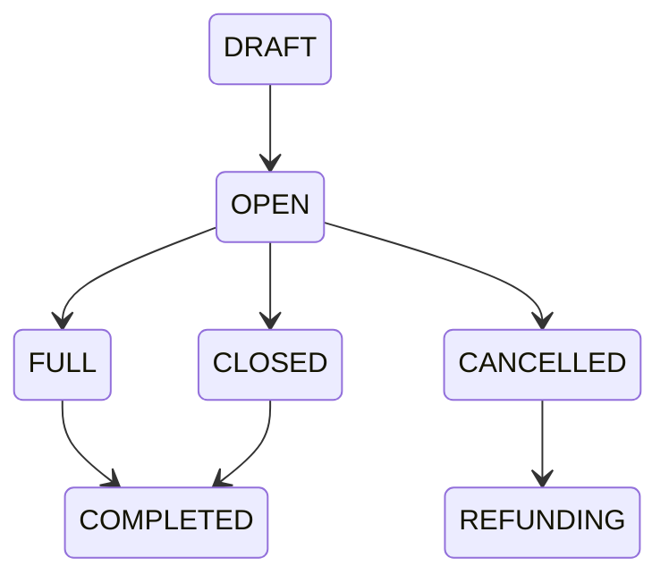

# Trip Process

Project: BusZ - Intercity Bus Ticket Booking Platform

Version: 1.0

Document Type: Business Process

Module: Trip Management

Priority: Critical

Status: Draft

---

# 1. Purpose

Tài liệu này mô tả toàn bộ quy trình quản lý và vận hành Trip trong hệ thống BusZ.

Trip là thực thể trung tâm kết nối:

- Route
- Bus
- Driver
- Seat
- Booking
- Ticket
- Payment
- Notification

Tài liệu này là nền tảng để thiết kế:

- Database
- Backend
- Flutter
- Admin Website
- API

---

# 2. Scope

Áp dụng cho:

- Customer Mobile App
- Admin Website
- Bus Company Portal
- Backend API
- Database

---

# 3. Business Goal

Một Trip đại diện cho một chuyến xe cụ thể.

Ví dụ:

Route

TP.HCM

↓

Đà Lạt

Date

10/08/2026

Time

08:00

Bus

Limousine 34

Driver

Nguyễn Văn A

---

# 4. Actors

Primary

Bus Company Manager

Secondary

Admin

Customer

Backend

Driver

Staff

---

# 5. Business Flow

```mermaid
flowchart TD

Create Route

-->

Assign Bus

-->

Assign Driver

-->

Configure Seats

-->

Configure Price

-->

Open Trip

-->

Customer Search

-->

Booking

-->

Payment

-->

Completed
```

---

# 6. Trip Lifecycle



---

# 7. Trip Status

DRAFT

Trip vừa tạo.

---

OPEN

Đang mở bán.

---

FULL

Đã hết ghế.

---

CLOSED

Ngừng bán.

---

DELAYED

Hoãn.

---

CANCELLED

Hủy chuyến.

---

COMPLETED

Đã kết thúc.

---

# 8. Trip Information

Một Trip gồm:

Trip Code

Trip Name

Route

Departure

Destination

Departure Time

Arrival Time

Bus

Driver

Seat Layout

Price Policy

Checkpoint

Status

---

# 9. Trip Creation

Manager tạo Trip.

↓

Chọn Route.

↓

Chọn Bus.

↓

Chọn Driver.

↓

Thiết lập thời gian.

↓

Thiết lập giá.

↓

Thiết lập Checkpoint.

↓

OPEN.

---

# 10. Seat Allocation

Trip

↓

Seat Layout

↓

Available Seat

↓

Hold Seat

↓

Booked Seat

↓

Completed

---

# 11. Price Policy

Giá có thể thay đổi theo:

Bus Type

Seat Type

Weekend

Holiday

Promotion

Peak Season

---

# 12. Driver Assignment

Một Driver

↓

Có thể lái nhiều Trip.

Nhưng

Không được trùng thời gian.

---

# 13. Bus Assignment

Một Bus

↓

Có nhiều Trip.

Nhưng

Không được chạy hai Trip cùng thời điểm.

---

# 14. Checkpoint

Trip có nhiều:

Pickup Point

Drop-off Point

Checkpoint

Mỗi Checkpoint có:

Tên

Địa chỉ

Latitude

Longitude

Arrival Time

Departure Time

---

# 15. Customer View

Customer xem:

Bus Company

Bus Type

Departure

Arrival

Duration

Facilities

Price

Promotion

Seat Left

Rating

Policy

---

# 16. Database Tables

routes

locations

trips

trip_prices

trip_checkpoints

trip_drivers

buses

drivers

seat_layouts

trip_seats

bookings

tickets

---

# 17. Related APIs

POST /trips

PUT /trips/{id}

DELETE /trips/{id}

GET /trips

GET /trips/{id}

GET /trips/search

GET /trips/{id}/seats

---

# 18. Validation Rules

Departure Time

<

Arrival Time

---

Bus

Không được trùng lịch.

---

Driver

Không được trùng lịch.

---

Trip Code

Unique.

---

Route

Phải tồn tại.

---

# 19. Exception Cases

Bus đang bảo trì.

↓

Không tạo Trip.

---

Driver nghỉ.

↓

Đổi Driver.

---

Trip bị hủy.

↓

Refund Booking.

↓

Notification.

---

Trip Delay.

↓

Update Time.

↓

Notification.

---

# 20. Notification

Trip Created

Trip Updated

Trip Cancelled

Trip Delayed

Trip Full

Trip Closed

---

# 21. Logging

Trip Created

Trip Updated

Trip Deleted

Price Updated

Driver Changed

Checkpoint Updated

---

# 22. Security

Chỉ:

Manager

Admin

được tạo Trip.

Customer

Chỉ được xem.

---

# 23. Reports

Total Trips

Completed Trips

Cancelled Trips

Average Occupancy

Revenue per Trip

Passenger Count

Popular Route

---

# 24. Acceptance Criteria

✓ Trip tạo thành công.

✓ Bus không bị trùng lịch.

✓ Driver không bị trùng lịch.

✓ Ghế được sinh đầy đủ.

✓ Giá đúng.

✓ Search hiển thị đúng.

✓ Booking hoạt động.

---

# 25. Future Expansion

Dynamic Pricing

AI Demand Forecast

GPS Tracking

Live Location

Driver App

Fleet Management

Maintenance Schedule

Carbon Emission Report

---

# 26. Related Documents

Search Process

Booking Process

Payment Process

Seat Management

Bus Company Process

Database Design

API Specification

---

# 27. Summary

Trip là trung tâm của toàn bộ hệ thống BusZ.

Mọi nghiệp vụ từ tìm kiếm, đặt vé, chọn ghế, thanh toán, phát hành vé và báo cáo đều dựa trên Trip.

Do đó mọi thay đổi về Trip phải được kiểm soát chặt chẽ để đảm bảo tính nhất quán và toàn vẹn dữ liệu trong toàn hệ thống.