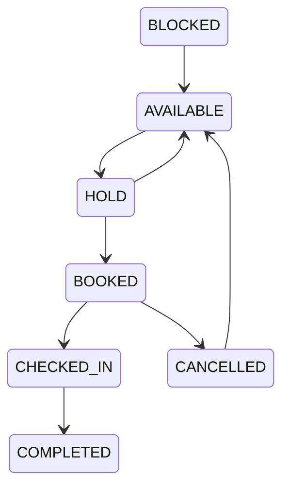

# Seat Management Process

Project: BusZ - Intercity Bus Ticket Booking Platform

Version: 1.0

Document Type: Business Process

Module: Seat Management

Priority: Critical

Status: Draft

---

# 1. Purpose

Tài liệu này mô tả toàn bộ quy trình quản lý ghế (Seat Management) trong hệ thống BusZ.

Seat Management chịu trách nhiệm:

- Khởi tạo sơ đồ ghế
- Quản lý trạng thái ghế
- Giữ ghế
- Mở ghế
- Khóa ghế
- Đồng bộ ghế với Booking
- Đồng bộ ghế với Payment
- Đồng bộ ghế với Check-in

Đây là module quan trọng nhất để tránh hiện tượng bán trùng ghế.

---

# 2. Scope

Áp dụng cho:

- Mobile Application
- Admin Website
- Bus Company Portal
- Backend API
- Database

---

# 3. Business Goal

Đảm bảo:

- Một ghế chỉ có một người sử dụng tại cùng một thời điểm.
- Không bán trùng ghế.
- Giữ ghế đúng thời gian.
- Đồng bộ trạng thái ghế theo thời gian thực.

---

# 4. Actors

Primary

Customer

Secondary

Backend

Bus Company Staff

Admin

Driver

---

# 5. Seat Lifecycle



---

# 6. Seat Status

AVAILABLE

Ghế còn trống.

---

HOLD

Ghế đang được giữ.

---

BOOKED

Ghế đã thanh toán.

---

CHECKED_IN

Khách đã lên xe.

---

COMPLETED

Chuyến đi kết thúc.

---

BLOCKED

Ghế khóa.

Không bán.

---

MAINTENANCE

Ghế hỏng.

Không sử dụng.

---

# 7. Seat Selection Flow

```mermaid
flowchart TD

Customer

-->

Open Seat Map

-->

Choose Seat

-->

Backend Validate

-->

Seat Available?

-->

YES

-->

Hold Seat

-->

Continue Booking

NO

-->

Choose Another Seat
```

---

# 8. Hold Seat

Khi Customer chọn ghế:

Backend

↓

Lock Seat

↓

Status

HOLD

↓

Start Countdown

---

Default

10 phút

(Có thể cấu hình)

---

# 9. Hold Expiration

Nếu:

Payment chưa hoàn thành.

↓

Hết thời gian giữ ghế.

↓

Seat

↓

AVAILABLE

↓

Booking

↓

EXPIRED

---

# 10. Booking Success

Payment Success

↓

Seat

↓

BOOKED

↓

Ticket

↓

Generated

---

# 11. Cancellation

Booking Cancelled

↓

Seat

↓

AVAILABLE

---

Refund

↓

Không ảnh hưởng ghế.

Ghế đã mở ngay khi hủy.

---

# 12. Check-in

Staff quét QR

↓

Ticket Valid

↓

Seat

↓

CHECKED_IN

---

# 13. Seat Types

Standard

Sleeper

VIP

Limousine

Cabin

Female Seat (Future)

Priority Seat (Future)

---

# 14. Seat Layout

Mỗi Bus có:

Seat Layout

↓

Rows

↓

Columns

↓

Seat Position

↓

Seat Type

↓

Seat Number

---

Ví dụ

A01

A02

A03

B01

B02

B03

---

# 15. Database Tables

seat_layouts

seat_layout_items

trip_seats

seat_holds

bookings

booking_items

tickets

---

# 16. API Flow

GET /trips/{id}/seats

↓

POST /seats/hold

↓

POST /seats/release

↓

POST /seats/book

↓

GET /seats/status

---

# 17. Validation Rules

Seat tồn tại.

Seat thuộc Trip.

Seat chưa BOOKED.

Seat chưa HOLD bởi người khác.

Seat không BLOCKED.

---

# 18. Exception Cases

Seat vừa bị người khác đặt.

↓

Thông báo.

↓

Refresh Seat Map.

---

Payment Timeout.

↓

Release Seat.

---

Internet Lost.

↓

Retry.

---

Bus Cancelled.

↓

Release All Seats.

↓

Refund.

---

# 19. Synchronization Rules

Seat Status luôn đồng bộ với:

Booking

Payment

Ticket

Check-in

Không được phép:

Booking SUCCESS

↓

Seat AVAILABLE

---

# 20. Notification

Seat Hold

Seat Released

Seat Booked

Seat Changed

Trip Cancelled

---

# 21. Logging

Seat Hold

Seat Release

Seat Booked

Seat Changed

Seat Blocked

Seat Checked In

---

# 22. Security

Customer

Chỉ được giữ ghế.

---

Staff

Check-in.

---

Manager

Khóa ghế.

---

Admin

Toàn quyền.

---

# 23. Reports

Seat Occupancy

Seat Usage

Seat Revenue

Available Seat

Most Selected Seat

Seat Type Revenue

---

# 24. Acceptance Criteria

✓ Không bán trùng ghế.

✓ Hold hoạt động.

✓ Countdown hoạt động.

✓ Payment cập nhật Seat.

✓ Refund mở ghế.

✓ Check-in đổi trạng thái.

✓ Seat Map đồng bộ.

---

# 25. Future Expansion

Real-time Seat Update

AI Seat Recommendation

Group Seat Selection

Family Seat

Accessible Seat

Seat Upgrade

Dynamic Seat Pricing

---

# 26. Related Documents

Trip Process

Booking Process

Payment Process

Check-in Process

Database Design

API Specification

---

# 27. Summary

Seat Management là module quan trọng nhất trong BusZ sau Booking và Payment.

Mọi thay đổi trạng thái ghế phải được đồng bộ theo thời gian thực giữa Mobile, Backend, Database và Website Admin để đảm bảo không xảy ra tình trạng bán trùng ghế hoặc mất dữ liệu.