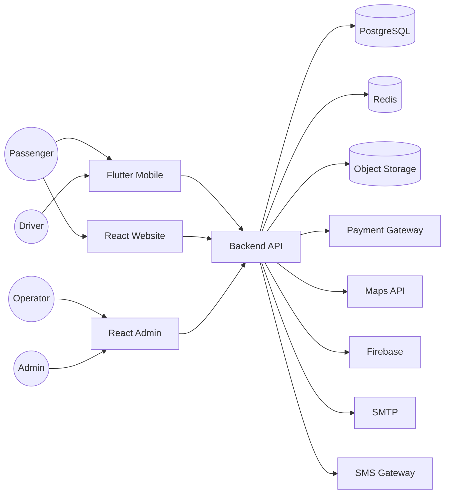

# System Overview Diagram

Project

BusZ - Intercity Bus Ticket Booking Platform

Module

Diagrams

Document ID

DIA-001

Priority

Critical

Version

1.0

---

# 1. Purpose

System Overview Diagram mô tả kiến trúc tổng quan của BusZ và mối quan hệ giữa các thành phần chính.

Mục tiêu

- Hiểu toàn bộ hệ thống
- Hỗ trợ Developer
- Hỗ trợ AI Code Generation
- Hỗ trợ triển khai
- Hỗ trợ bảo trì

---

# 2. System Context



---

# 3. Client Layer

```text
Flutter Mobile

Passenger Website

Admin Portal

Driver App

Operator Portal
```

---

# 4. Business Layer

```text
Authentication

Search

Booking

Seat

Trip

Payment

Ticket

Notification

Review

Admin
```

---

# 5. Infrastructure Layer

```text
PostgreSQL

Redis

Storage

Docker

Kubernetes

Monitoring
```

---

# 6. External Services

```text
VNPay

MoMo

ZaloPay

Firebase

Google Maps

SMTP

SMS Gateway
```

---

# 7. Architecture Style

```text
Layered Architecture

REST API

Stateless Backend

JWT Authentication

Repository Pattern
```

---

# 8. Communication

```text
HTTPS

REST API

WebSocket

Webhook
```

---

# 9. Benefits

```text
High Availability

Scalability

Maintainability

Loose Coupling

Easy Deployment
```

---

# 10. Summary

System Overview Diagram là sơ đồ cấp cao mô tả toàn bộ kiến trúc BusZ, bao gồm các tác nhân, ứng dụng khách, backend, cơ sở dữ liệu và các dịch vụ bên ngoài. Đây là sơ đồ đầu tiên cần đọc để hiểu tổng thể hệ thống trước khi đi vào các sơ đồ chi tiết hơn.