# Use Case Diagram

Project

BusZ - Intercity Bus Ticket Booking Platform

Module

Diagrams

Document ID

DIA-002

Priority

Critical

Version

1.0

---

# 1. Purpose

Use Case Diagram mô tả các tác nhân chính và chức năng mà họ có thể thực hiện trong hệ thống BusZ.

Mục tiêu

- Xác định actor của hệ thống
- Xác định chức năng chính
- Làm rõ phạm vi nghiệp vụ
- Hỗ trợ Business Analyst
- Hỗ trợ Developer và AI Code Generation

---

# 2. Actors

```text
Passenger

Driver

Operator

Admin

Super Admin

Payment Gateway

Notification Service

Map Service
```

---

# 3. Passenger Use Cases

```text
Register

Login

Search Trip

View Trip Detail

Select Seat

Create Booking

Make Payment

View Ticket

Cancel Booking

Request Refund

Write Review

Manage Profile

Receive Notification
```

---

# 4. Driver Use Cases

```text
Login

View Assigned Trips

View Passenger List

Scan QR Ticket

Check-in Passenger

Update Trip Status

View Route Map
```

---

# 5. Operator Use Cases

```text
Login

Manage Trips

Manage Vehicles

Manage Drivers

View Bookings

Update Schedule

Cancel Trip

View Revenue
```

---

# 6. Admin Use Cases

```text
Manage Users

Manage Operators

Manage Routes

Manage Trips

Manage Payments

Manage Promotions

View Reports

Monitor System

Handle Refunds
```

---

# 7. Super Admin Use Cases

```text
Manage Admin Accounts

Manage Roles

Manage Permissions

System Configuration

Audit Logs

Compliance

Security Settings
```

---

# 8. Use Case Diagram

```mermaid
flowchart LR
    Passenger((Passenger))
    Driver((Driver))
    Operator((Operator))
    Admin((Admin))
    SuperAdmin((Super Admin))

    Register[Register]
    Login[Login]
    SearchTrip[Search Trip]
    SelectSeat[Select Seat]
    CreateBooking[Create Booking]
    MakePayment[Make Payment]
    ViewTicket[View Ticket]
    CancelBooking[Cancel Booking]
    Review[Write Review]

    AssignedTrips[View Assigned Trips]
    ScanQR[Scan QR Ticket]
    Checkin[Check-in Passenger]
    UpdateTrip[Update Trip Status]

    ManageTrips[Manage Trips]
    ManageVehicles[Manage Vehicles]
    ManageDrivers[Manage Drivers]
    ViewRevenue[View Revenue]

    ManageUsers[Manage Users]
    ManageRoutes[Manage Routes]
    ManagePayments[Manage Payments]
    ManagePromotions[Manage Promotions]
    Reports[View Reports]

    ManageRoles[Manage Roles]
    SystemConfig[System Configuration]
    AuditLogs[Audit Logs]

    Passenger --> Register
    Passenger --> Login
    Passenger --> SearchTrip
    Passenger --> SelectSeat
    Passenger --> CreateBooking
    Passenger --> MakePayment
    Passenger --> ViewTicket
    Passenger --> CancelBooking
    Passenger --> Review

    Driver --> Login
    Driver --> AssignedTrips
    Driver --> ScanQR
    Driver --> Checkin
    Driver --> UpdateTrip

    Operator --> Login
    Operator --> ManageTrips
    Operator --> ManageVehicles
    Operator --> ManageDrivers
    Operator --> ViewRevenue

    Admin --> ManageUsers
    Admin --> ManageRoutes
    Admin --> ManagePayments
    Admin --> ManagePromotions
    Admin --> Reports

    SuperAdmin --> ManageRoles
    SuperAdmin --> SystemConfig
    SuperAdmin --> AuditLogs
```



---

# 9. Passenger Main Flow

```text
Register / Login

↓

Search Trip

↓

Select Seat

↓

Create Booking

↓

Payment

↓

Receive Ticket

↓

Check-in

↓

Review
```

---

# 10. Admin Main Flow

```text
Login

↓

Dashboard

↓

Manage Data

↓

Monitor Bookings

↓

Handle Payments

↓

View Reports
```

---

# 11. Operator Main Flow

```text
Login

↓

Manage Vehicle

↓

Manage Driver

↓

Create Trip

↓

Monitor Booking

↓

View Revenue
```

---

# 12. Driver Main Flow

```text
Login

↓

View Assigned Trip

↓

View Passenger List

↓

Scan QR

↓

Check-in Passenger

↓

Update Trip Status
```

---

# 13. External System Use Cases

Payment Gateway

```text
Process Payment

Send Webhook

Process Refund
```

Notification Service

```text
Send Push Notification

Send Email

Send SMS
```

Map Service

```text
Show Route

Calculate Distance

Provide GPS Coordinates
```

---

# 14. Business Rules

```text
Passenger must login before booking.

Passenger can only cancel own booking.

Driver can only check-in passengers of assigned trip.

Operator can only manage own company data.

Admin can manage global system data.

Super Admin can manage roles and permissions.
```

---

# 15. Acceptance Criteria

✓ Actors được xác định đầy đủ

✓ Use cases chính được mô tả

✓ Passenger flow rõ ràng

✓ Admin flow rõ ràng

✓ Operator flow rõ ràng

✓ Driver flow rõ ràng

✓ External systems được thể hiện

---

# 16. Related Documents

01_System_Overview

03_Activity_Diagram

04_Sequence_Diagram

05_ER_Diagram

API Specification

Business Rules

---

# 17. Summary

Use Case Diagram mô tả các actor chính và chức năng mà họ tương tác trong BusZ. Sơ đồ này giúp xác định phạm vi hệ thống, phân quyền nghiệp vụ và các luồng chính dành cho Passenger, Driver, Operator, Admin và Super Admin.