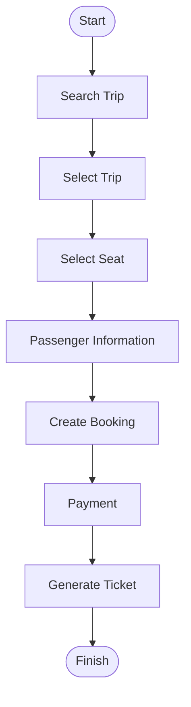
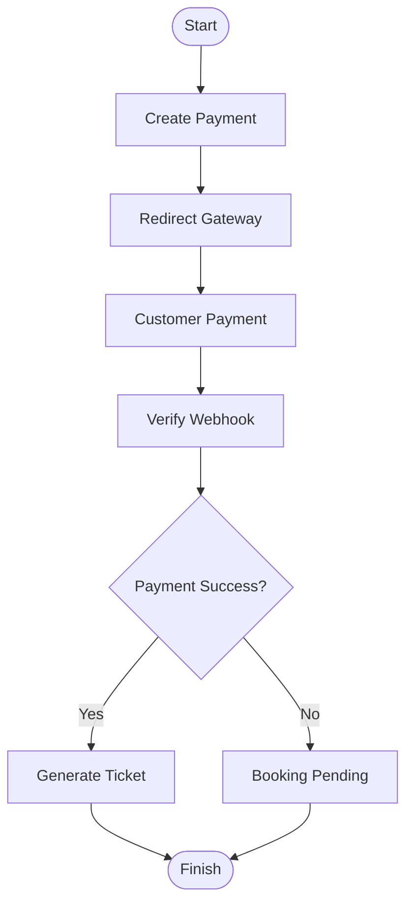
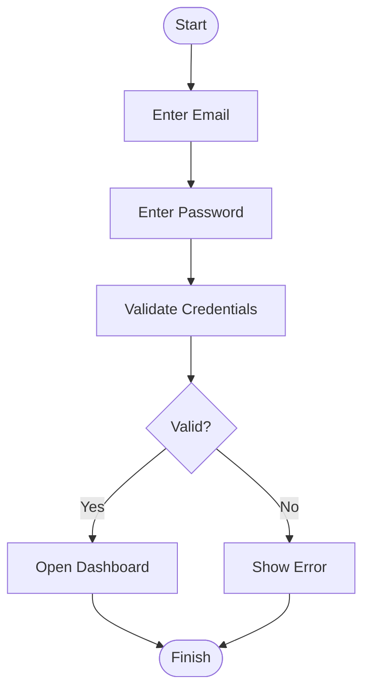
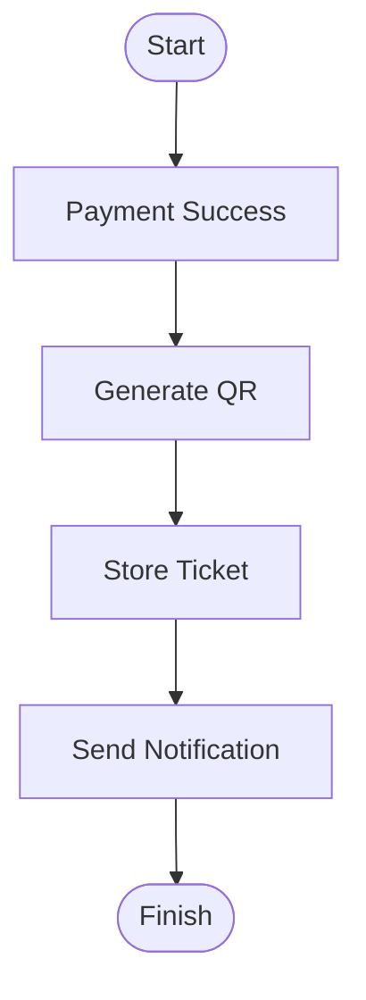
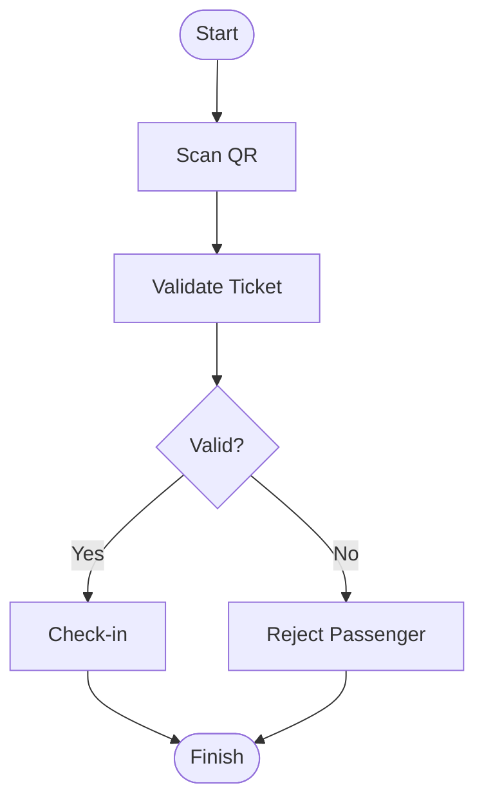
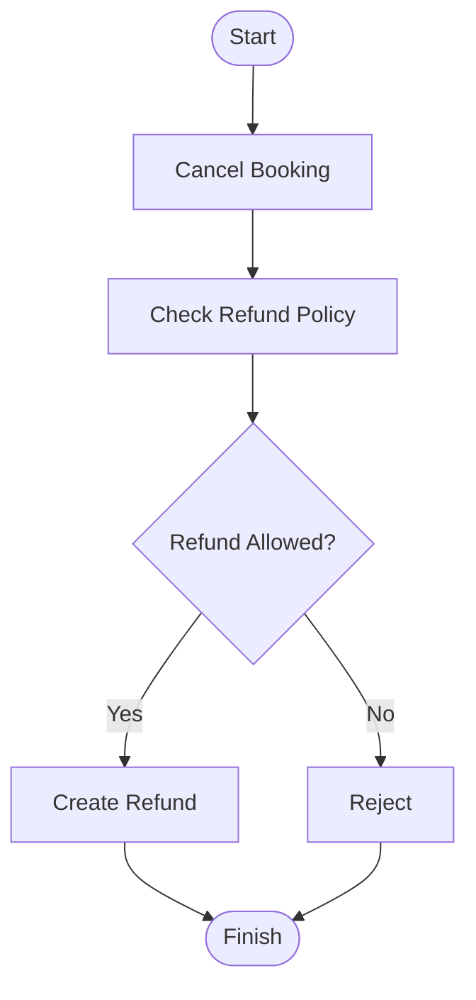
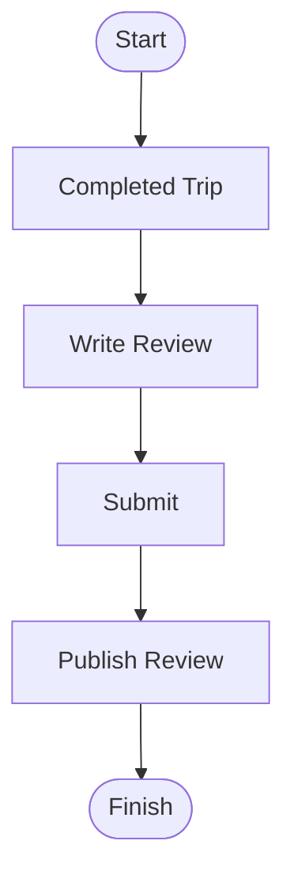
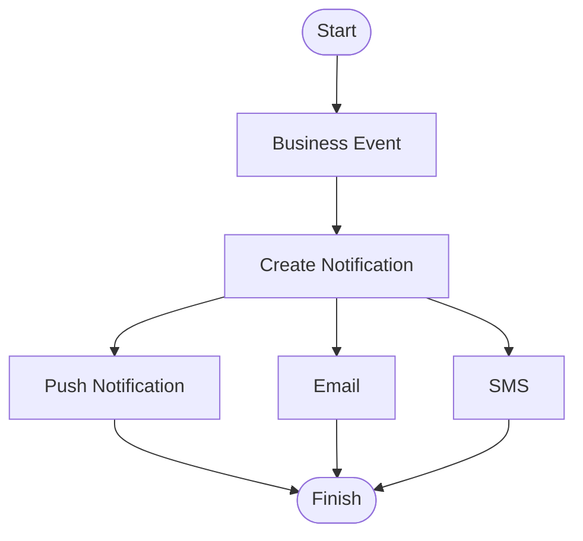
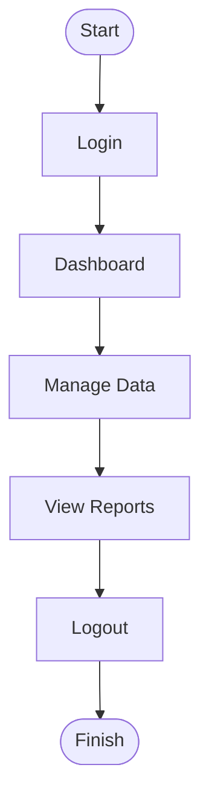

# Activity Diagram

Project

BusZ - Intercity Bus Ticket Booking Platform

Module

Diagrams

Document ID

DIA-003

Priority

Critical

Version

1.0

---

# 1. Purpose

Activity Diagram mô tả luồng hoạt động của các nghiệp vụ chính trong hệ thống BusZ từ khi người dùng thao tác đến khi hoàn thành nghiệp vụ.

Mục tiêu

- Mô tả Business Workflow
- Hỗ trợ Developer
- Hỗ trợ QA
- Hỗ trợ Business Analyst
- Hỗ trợ AI Code Generation

---

# 2. Activity Overview

Bao gồm

```text
Authentication

Booking

Payment

Ticket

Check-in

Refund

Review
```

---

# 3. Booking Activity



---

# 4. Payment Activity



---

# 5. Login Activity



---

# 6. Ticket Activity



---

# 7. Driver Check-in Activity



---

# 8. Refund Activity



---

# 9. Review Activity



---

# 10. Notification Activity



---

# 11. Admin Activity



---

# 12. Activity Summary

Các Activity Diagram bao phủ

```text
Authentication

Booking

Payment

Ticket

Check-in

Refund

Notification

Review

Administration
```

---

# 13. Acceptance Criteria

✓ Luồng Booking đầy đủ

✓ Luồng Payment đầy đủ

✓ Luồng Ticket đầy đủ

✓ Luồng Check-in đầy đủ

✓ Luồng Refund đầy đủ

✓ Luồng Notification đầy đủ

✓ Có Mermaid Diagram

---

# 14. Related Documents

Use Case Diagram

Sequence Diagram

State Diagram

Business Rules

API Specification

---

# 15. Summary

Activity Diagram mô tả các quy trình nghiệp vụ chính của BusZ theo trình tự hoạt động từ khi bắt đầu đến khi hoàn thành. Các sơ đồ này giúp Developer, QA và AI hiểu rõ luồng xử lý nghiệp vụ, hỗ trợ triển khai và kiểm thử hệ thống một cách chính xác.