# Sequence Diagram

Project

BusZ - Intercity Bus Ticket Booking Platform

Module

Diagrams

Document ID

DIA-004

Priority

Critical

Version

1.0

---

# 1. Purpose

Sequence Diagram mô tả trình tự tương tác giữa các thành phần trong hệ thống BusZ.

Mục tiêu

- Hiểu luồng nghiệp vụ
- Hỗ trợ Backend Development
- Hỗ trợ Frontend Development
- Hỗ trợ QA
- Hỗ trợ AI Code Generation

---

# 2. Covered Scenarios

```text
Authentication

Search Trip

Seat Hold

Booking

Payment

Ticket

Notification

Refund

Driver Check-in

Review
```

---

# 3. Login Sequence

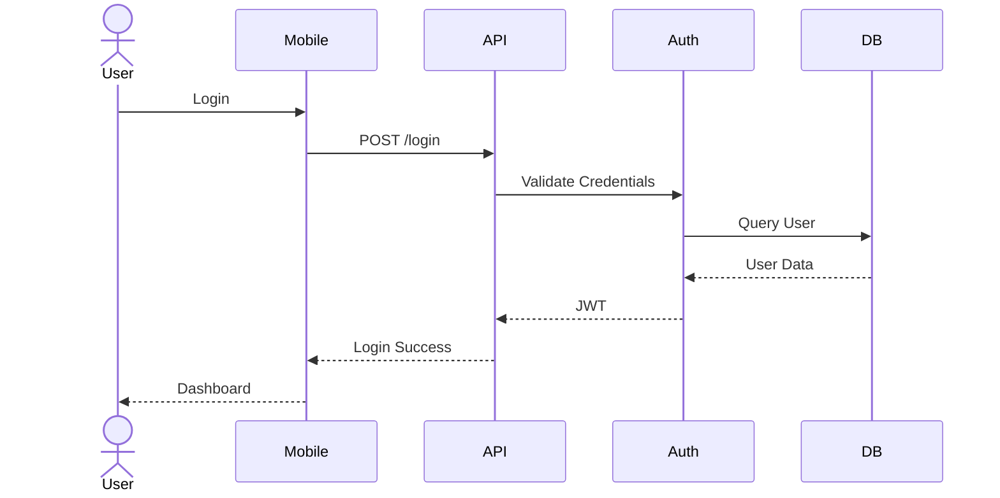

---

# 4. Search Trip Sequence

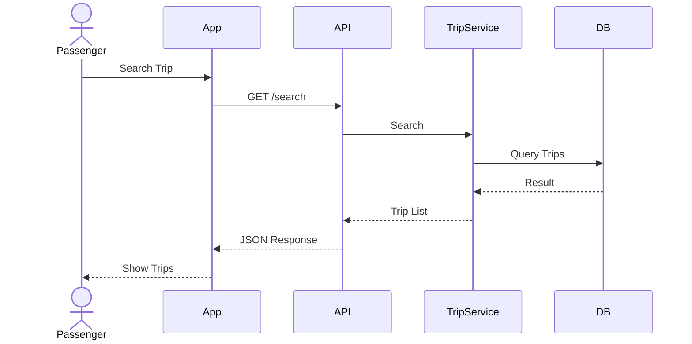

---

# 5. Seat Hold Sequence

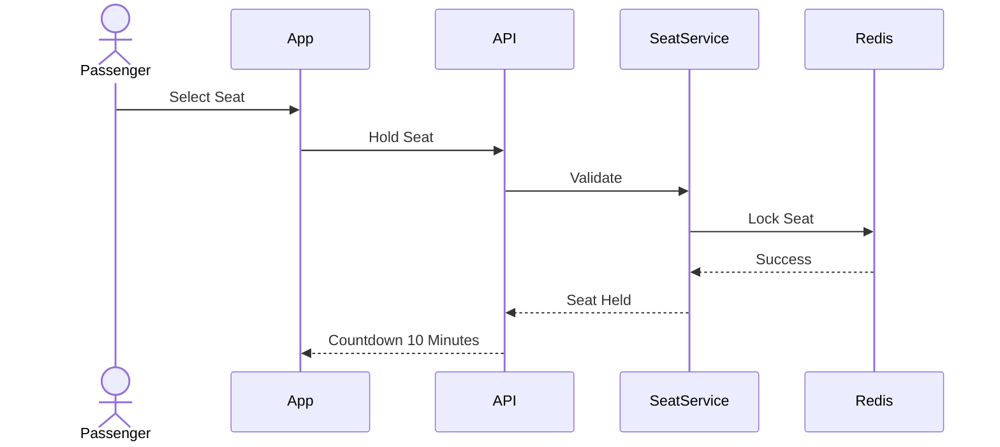

---

# 6. Booking Sequence

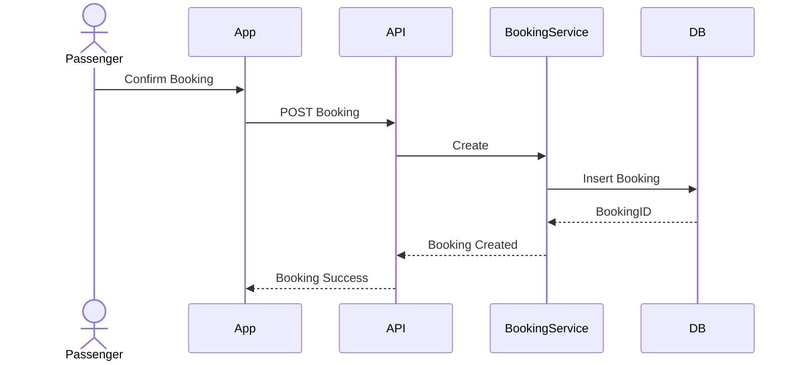

---

# 7. Payment Sequence

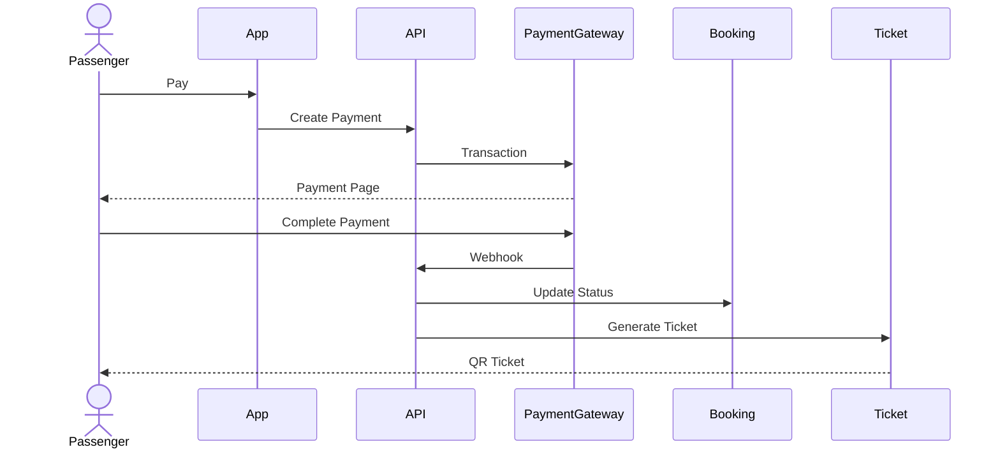

---

# 8. Ticket Sequence

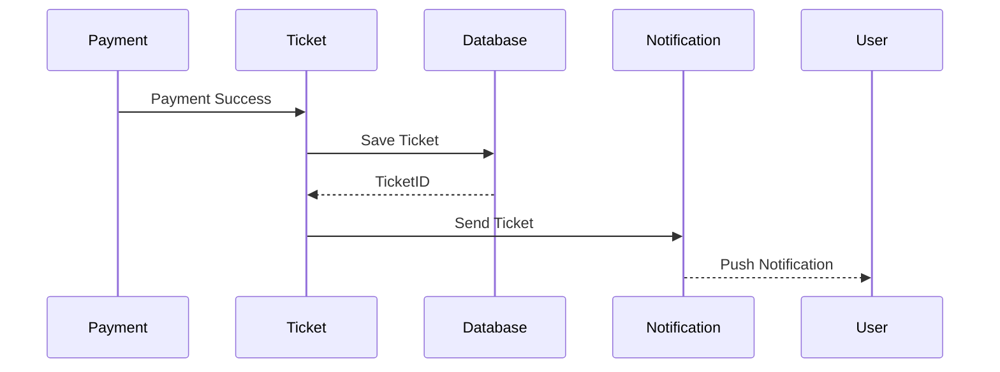

---

# 9. Driver Check-in Sequence

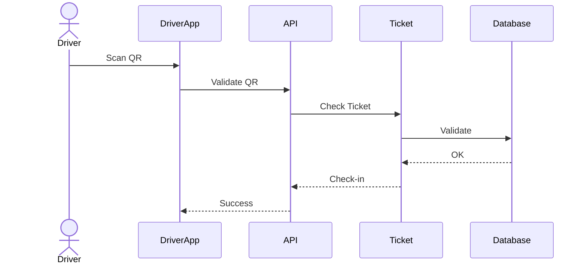

---

# 10. Refund Sequence

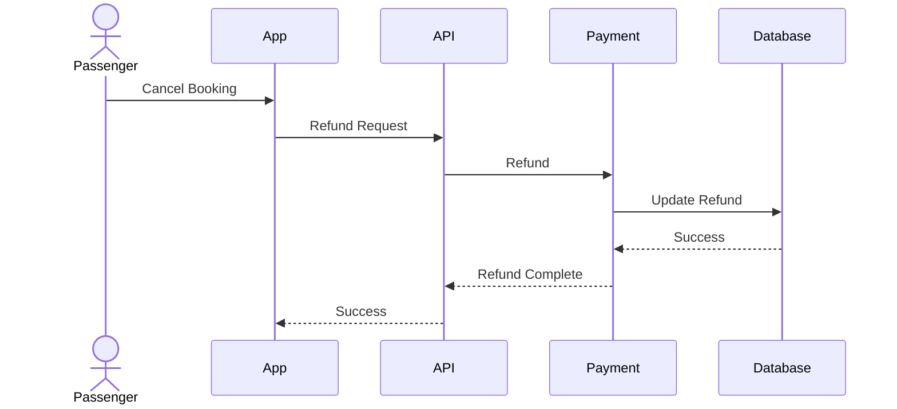

---

# 11. Notification Sequence

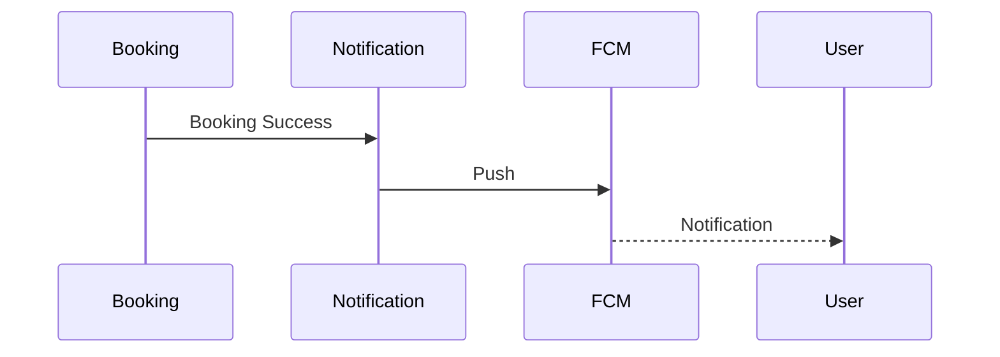

---

# 12. Review Sequence

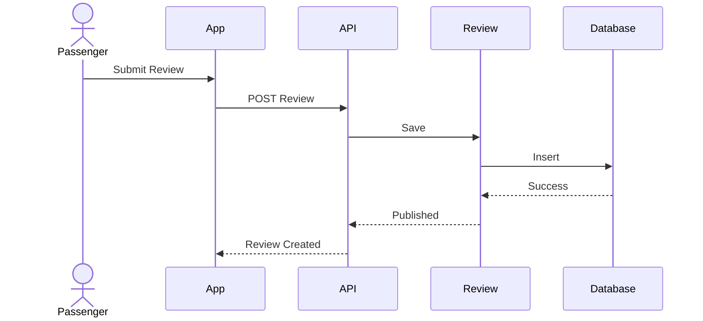

---

# 13. Admin Sequence

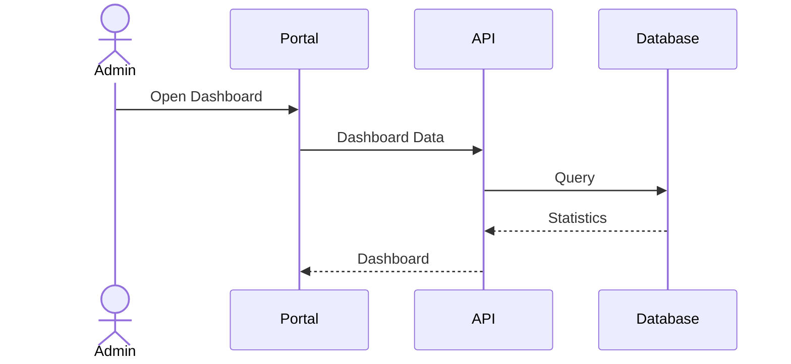

---

# 14. Error Flow

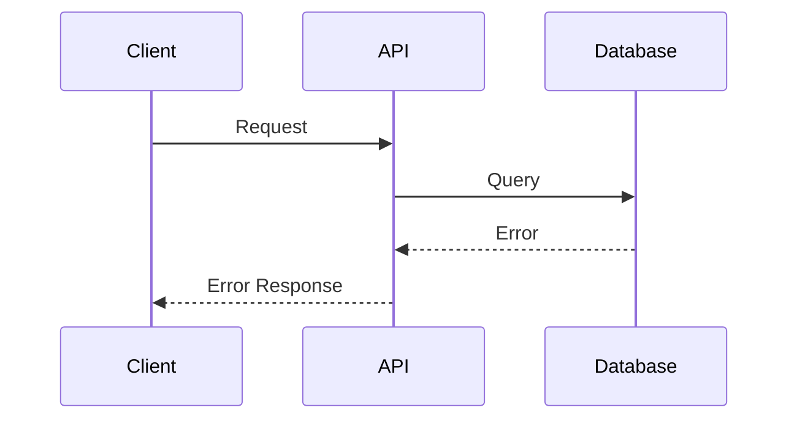

---

# 15. Timeout Flow

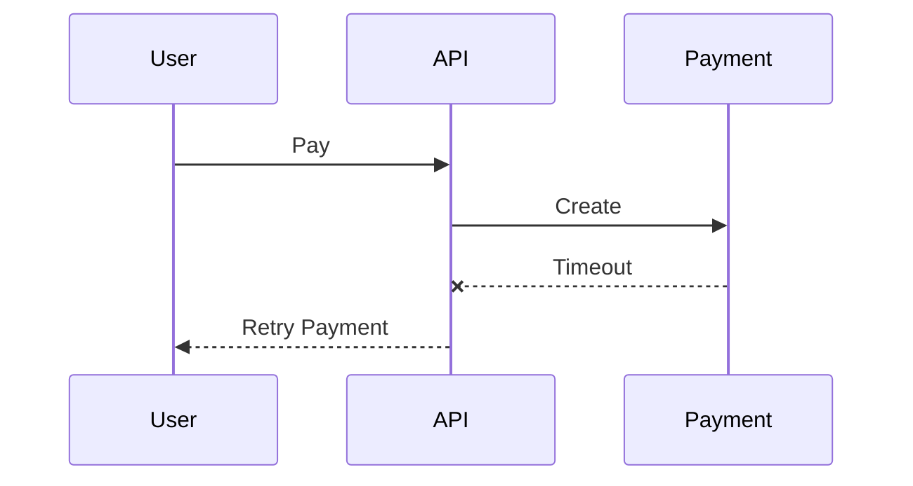

---

# 16. Acceptance Criteria

✓ Authentication Sequence đầy đủ

✓ Booking Sequence đầy đủ

✓ Payment Sequence đầy đủ

✓ Ticket Sequence đầy đủ

✓ Refund Sequence đầy đủ

✓ Driver Check-in đầy đủ

✓ Mermaid Diagram hợp lệ

---

# 17. Related Documents

System Overview

Use Case Diagram

Activity Diagram

ER Diagram

Component Diagram

API Specification

Business Rules

---

# 18. Summary

Sequence Diagram mô tả chi tiết trình tự tương tác giữa người dùng, ứng dụng, Backend API, Database và các dịch vụ bên ngoài trong từng nghiệp vụ của BusZ. Các sơ đồ này giúp Developer, QA và AI hiểu rõ cách các thành phần phối hợp với nhau để xử lý các chức năng quan trọng như đăng nhập, tìm chuyến, đặt vé, thanh toán, phát hành vé, hoàn tiền và check-in.