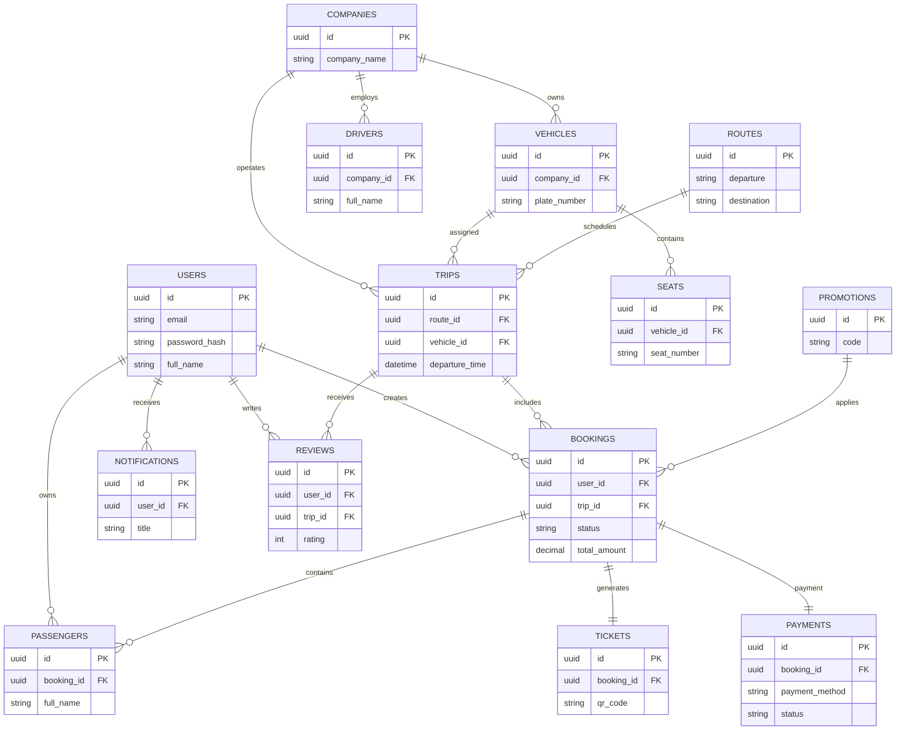

# Entity Relationship Diagram (ERD)

Project

BusZ - Intercity Bus Ticket Booking Platform

Module

Diagrams

Document ID

DIA-005

Priority

Critical

Version

1.0

---

# 1. Purpose

Entity Relationship Diagram (ERD) mô tả cấu trúc dữ liệu và mối quan hệ giữa các bảng trong cơ sở dữ liệu BusZ.

Mục tiêu

- Thiết kế Database
- Xác định Primary Key
- Xác định Foreign Key
- Hỗ trợ Backend Development
- Hỗ trợ Database Migration
- Hỗ trợ AI Code Generation

---

# 2. Database Overview

```text
Authentication

Users

Companies

Vehicles

Drivers

Routes

Trips

Seats

Bookings

Passengers

Payments

Tickets

Promotions

Reviews

Notifications

Audit Logs
```

---

# 3. Main Entities

```text
Users

Companies

Drivers

Vehicles

Routes

Trips

Seats

Bookings

Passengers

Payments

Tickets

Promotions

Reviews

Notifications

AuditLogs
```

---

# 4. Relationship Overview

```text
User

↓

Booking

↓

Payment

↓

Ticket
```

---

# 5. User Relationships

```text
User

1 ---- N Booking

1 ---- N Passenger

1 ---- N Notification

1 ---- N Review
```

---

# 6. Company Relationships

```text
Company

1 ---- N Vehicle

1 ---- N Driver

1 ---- N Trip
```

---

# 7. Vehicle Relationships

```text
Vehicle

1 ---- N Seat

1 ---- N Trip
```

---

# 8. Route Relationships

```text
Route

1 ---- N Trip
```

---

# 9. Trip Relationships

```text
Trip

1 ---- N Seat

1 ---- N Booking

1 ---- 1 Vehicle

1 ---- 1 Route
```

---

# 10. Booking Relationships

```text
Booking

1 ---- N Passenger

1 ---- 1 Payment

1 ---- 1 Ticket

1 ---- 1 Trip

1 ---- 1 User
```

---

# 11. Payment Relationships

```text
Payment

1 ---- 1 Booking
```

---

# 12. Ticket Relationships

```text
Ticket

1 ---- 1 Booking
```

---

# 13. Review Relationships

```text
Review

N ---- 1 User

N ---- 1 Trip
```

---

# 14. Notification Relationships

```text
Notification

N ---- 1 User
```

---

# 15. Promotion Relationships

```text
Promotion

1 ---- N Booking
```

---

# 16. Audit Log Relationships

```text
AuditLog

N ---- 1 User
```

---

# 17. Complete ER Diagram



---

# 18. Primary Keys

```text
UUID

Auto Generated
```

---

# 19. Foreign Keys

```text
user_id

booking_id

trip_id

vehicle_id

route_id

company_id

promotion_id
```

---

# 20. Cardinality

```text
1 : 1

1 : N

N : N (resolved bằng bảng trung gian nếu cần)
```

---

# 21. Normalization

Áp dụng

```text
First Normal Form

Second Normal Form

Third Normal Form
```

---

# 22. Constraints

```text
Primary Key

Foreign Key

Unique

Check

Not Null
```

---

# 23. Index Strategy

```text
Email

Phone

Booking Code

Ticket Code

QR Code

Departure Time

Route

Payment Status
```

---

# 24. Acceptance Criteria

✓ Tất cả bảng được định nghĩa

✓ Quan hệ đầy đủ

✓ PK rõ ràng

✓ FK rõ ràng

✓ ER Diagram hợp lệ

✓ Mermaid render thành công

---

# 25. Related Documents

Database Schema

Database Dictionary

API Specification

Class Diagram

Component Diagram

---

# 26. Summary

ER Diagram mô tả cấu trúc dữ liệu cốt lõi của BusZ, bao gồm các thực thể, khóa chính, khóa ngoại và quan hệ giữa các bảng. Đây là tài liệu nền tảng cho việc thiết kế cơ sở dữ liệu, triển khai Backend và sinh mã ORM bằng Prisma hoặc các công cụ AI.