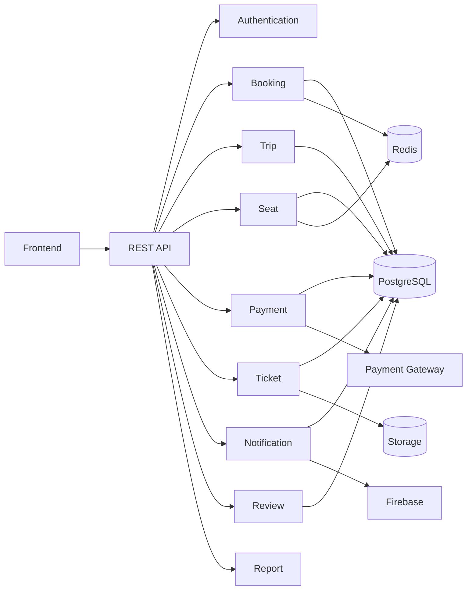

# Component Diagram

Project

BusZ - Intercity Bus Ticket Booking Platform

Module

Diagrams

Document ID

DIA-006

Priority

Critical

Version

1.0

---

# 1. Purpose

Component Diagram mô tả cấu trúc các thành phần (Components) của hệ thống BusZ và cách các thành phần này tương tác với nhau.

Mục tiêu

- Phân chia module rõ ràng
- Hỗ trợ phát triển Backend
- Hỗ trợ Frontend
- Hỗ trợ AI Code Generation
- Hỗ trợ bảo trì hệ thống

---

# 2. Component Overview

```text
Frontend

↓

API Gateway

↓

Application Services

↓

Infrastructure

↓

Database

↓

External Services
```

---

# 3. Frontend Components

```text
Flutter Mobile App

Passenger Website

Admin Portal

Driver App

Operator Portal
```

---

# 4. API Components

```text
REST API

Authentication Middleware

Validation Middleware

Authorization Middleware

Exception Handler

Logging Middleware
```

---

# 5. Business Components

```text
Authentication Service

User Service

Route Service

Trip Service

Vehicle Service

Seat Service

Booking Service

Passenger Service

Payment Service

Ticket Service

Promotion Service

Notification Service

Review Service

Report Service
```

---

# 6. Infrastructure Components

```text
PostgreSQL

Redis

Object Storage

SMTP

Firebase

Payment Gateway

Google Maps
```

---

# 7. Authentication Component

Chức năng

```text
Register

Login

Refresh Token

JWT

RBAC

Password Reset
```

---

# 8. Booking Component

Chức năng

```text
Create Booking

Update Booking

Cancel Booking

Booking History

Booking Validation
```

---

# 9. Payment Component

Chức năng

```text
Create Payment

Verify Payment

Webhook

Refund

Invoice
```

---

# 10. Ticket Component

Chức năng

```text
Generate QR

Generate PDF

Validate Ticket

Driver Check-in
```

---

# 11. Notification Component

Chức năng

```text
Push Notification

Email

SMS

In-App Notification
```

---

# 12. Report Component

```text
Revenue Report

Booking Report

Trip Report

Payment Report

Customer Report
```

---

# 13. Component Relationship



---

# 14. Internal Dependency

```text
Booking

↓

Seat

↓

Payment

↓

Ticket

↓

Notification
```

---

# 15. External Dependency

```text
Google Maps

Payment Gateway

Firebase

SMTP

SMS Gateway
```

---

# 16. Communication

```text
REST API

HTTPS

Webhook

Push Notification
```

---

# 17. Design Principles

```text
Single Responsibility

Loose Coupling

High Cohesion

Dependency Injection

Repository Pattern

Service Layer
```

---

# 18. Scalability

Mỗi Component có thể

```text
Deploy riêng

Scale riêng

Monitor riêng

Log riêng
```

---

# 19. Security

Áp dụng

```text
JWT

RBAC

HTTPS

Rate Limit

Input Validation

Audit Log
```

---

# 20. Error Handling

```text
Validation Error

Business Error

Infrastructure Error

External Service Error

Unexpected Error
```

---

# 21. Acceptance Criteria

✓ Components được tách rõ

✓ Dependency rõ ràng

✓ Mermaid Diagram hợp lệ

✓ Có External Components

✓ Có Internal Components

✓ Có Communication Flow

---

# 22. Related Documents

System Overview

ER Diagram

Class Diagram

Deployment Diagram

API Specification

Database Schema

---

# 23. Summary

Component Diagram mô tả kiến trúc thành phần của BusZ theo hướng phân tầng (Layered Architecture). Các module như Authentication, Booking, Payment, Ticket và Notification được tách biệt rõ ràng, giúp hệ thống dễ bảo trì, mở rộng và hỗ trợ tốt cho việc triển khai theo kiến trúc Microservices hoặc Modular Monolith trong tương lai.