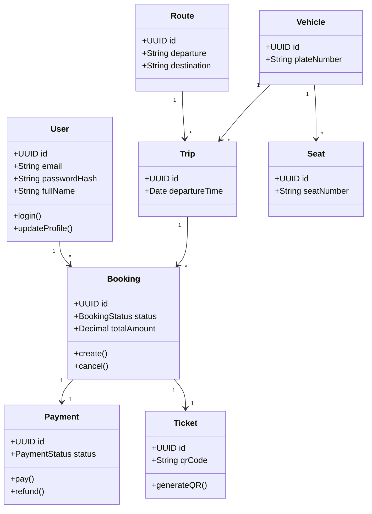

# Class Diagram

Project

BusZ - Intercity Bus Ticket Booking Platform

Module

Diagrams

Document ID

DIA-008

Priority

Critical

Version

1.0

---

# 1. Purpose

Class Diagram mô tả cấu trúc hướng đối tượng của hệ thống BusZ, bao gồm các Entity, Model, Service và mối quan hệ giữa chúng.

Mục tiêu

- Thiết kế Domain Model
- Hỗ trợ Backend Development
- Hỗ trợ ORM (Prisma)
- Hỗ trợ AI Code Generation
- Hỗ trợ Database Design

---

# 2. Class Categories

```text
Entities

Services

Repositories

DTOs

Enums

Utilities
```

---

# 3. Core Entities

```text
User

Company

Driver

Vehicle

Route

Trip

Seat

Booking

Passenger

Payment

Ticket

Promotion

Review

Notification

AuditLog
```

---

# 4. Authentication Classes

```text
User

Role

Permission

RefreshToken

OTP
```

---

# 5. Booking Classes

```text
Booking

Passenger

BookingStatus

BookingHistory
```

---

# 6. Payment Classes

```text
Payment

Refund

Invoice

PaymentMethod

PaymentTransaction
```

---

# 7. Ticket Classes

```text
Ticket

QRCode

CheckInRecord
```

---

# 8. Trip Classes

```text
Route

Trip

Checkpoint

BusStation
```

---

# 9. Vehicle Classes

```text
Vehicle

Seat

SeatLayout
```

---

# 10. Notification Classes

```text
Notification

EmailMessage

PushMessage

SMSMessage
```

---

# 11. Review Classes

```text
Review

Rating

ReviewReply
```

---

# 12. Main Relationships

```text
User

↓

Booking

↓

Payment

↓

Ticket
```

---

# 13. UML Class Diagram



---

# 14. Service Classes

```text
AuthService

BookingService

TripService

SeatService

PaymentService

TicketService

NotificationService

ReviewService
```

---

# 15. Repository Classes

```text
UserRepository

BookingRepository

TripRepository

PaymentRepository

TicketRepository

NotificationRepository
```

---

# 16. DTO Classes

```text
LoginRequest

RegisterRequest

BookingRequest

PaymentRequest

ReviewRequest

UserResponse

BookingResponse
```

---

# 17. Enum Classes

```text
BookingStatus

PaymentStatus

TripStatus

SeatStatus

Role

NotificationType
```

---

# 18. Composition

```text
Booking

contains

Passenger
```

---

# 19. Aggregation

```text
Trip

uses

Vehicle
```

---

# 20. Association

```text
User

creates

Booking
```

---

# 21. Dependency

```text
BookingService

depends on

PaymentService
```

---

# 22. Inheritance

```text
Notification

↓

PushNotification

↓

EmailNotification

↓

SMSNotification
```

---

# 23. Design Patterns

```text
Repository Pattern

Service Layer

Factory

Strategy

Dependency Injection
```

---

# 24. SOLID Principles

```text
Single Responsibility

Open Closed

Liskov

Interface Segregation

Dependency Inversion
```

---

# 25. Acceptance Criteria

✓ Entity đầy đủ

✓ UML hợp lệ

✓ Quan hệ chính xác

✓ Service rõ ràng

✓ Repository rõ ràng

✓ AI có thể sinh Entity

---

# 26. Related Documents

ER Diagram

Component Diagram

Database Schema

API Specification

Business Rules

---

# 27. Summary

Class Diagram mô tả toàn bộ mô hình hướng đối tượng của BusZ, bao gồm Entity, Service, Repository và DTO. Đây là tài liệu quan trọng giúp Backend Developer và AI sinh Model, Entity, Prisma Schema, Service và Controller một cách chính xác.