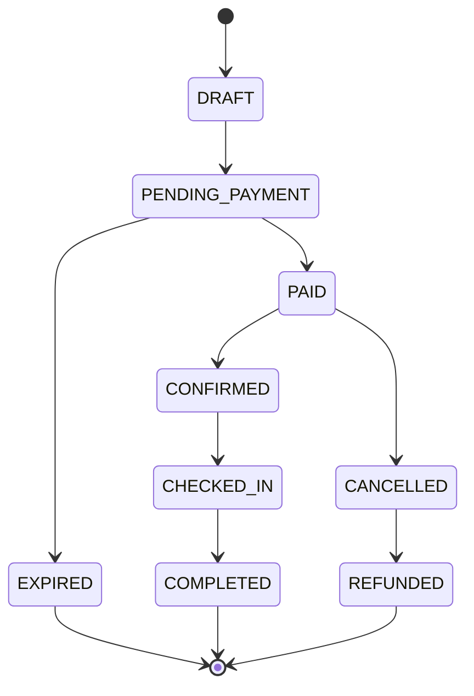
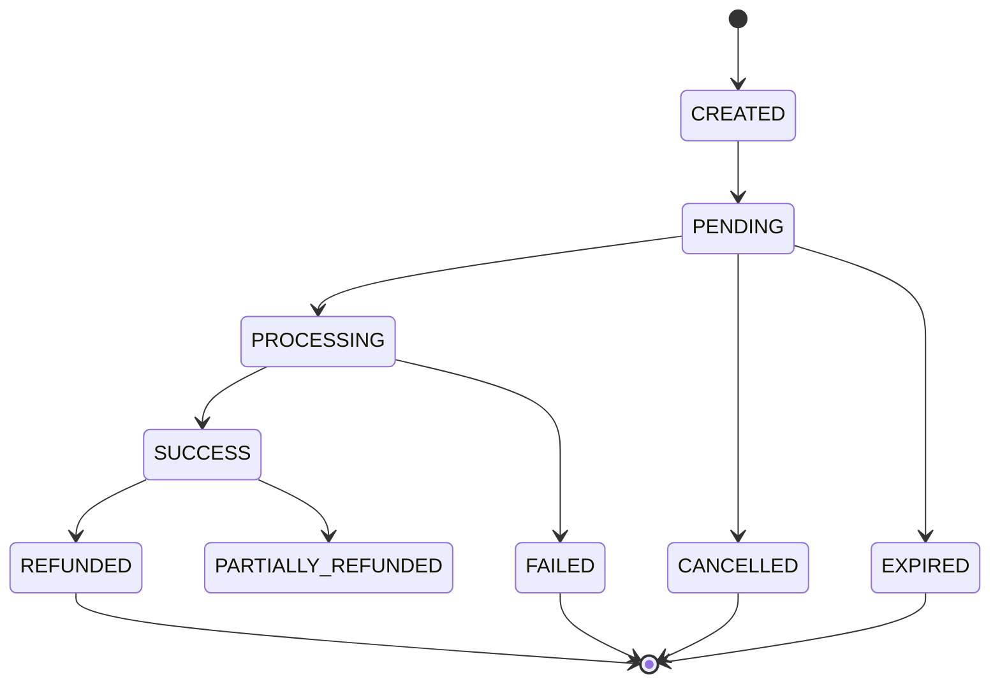
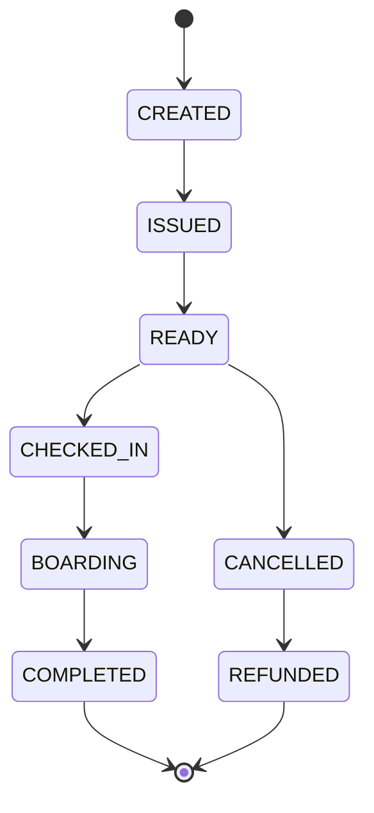
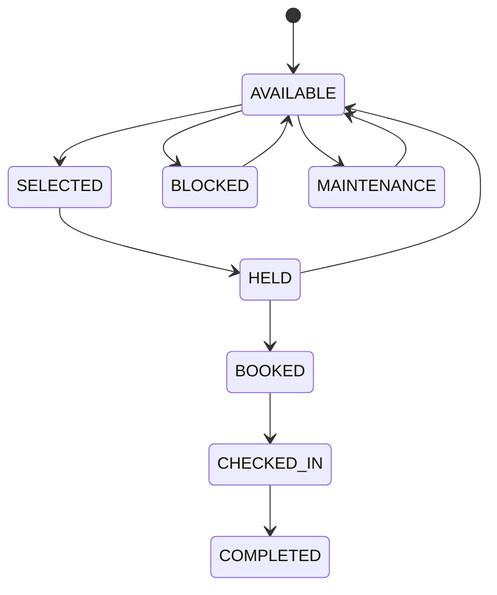
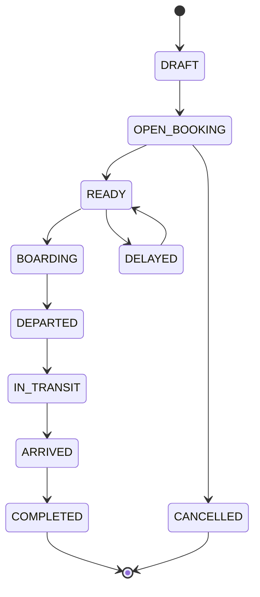
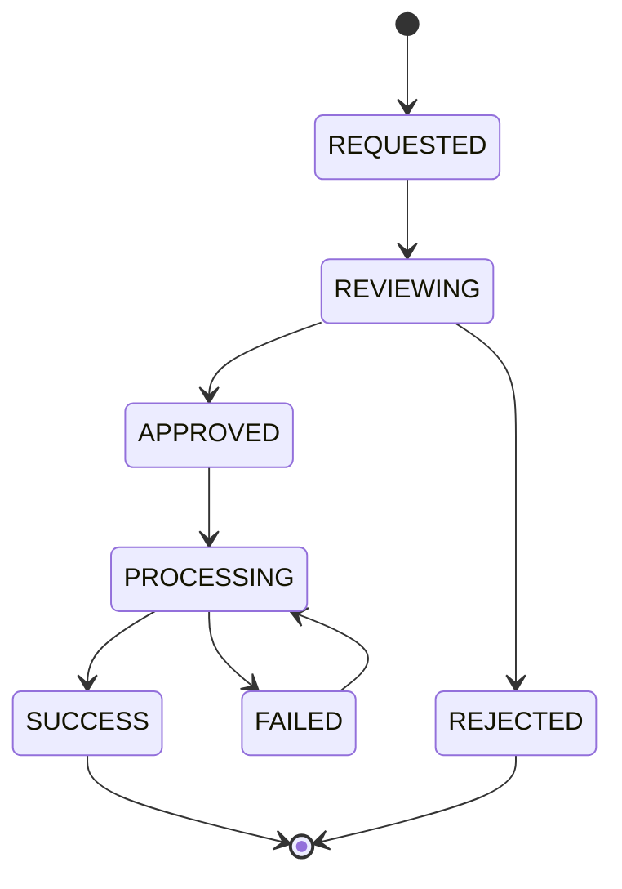
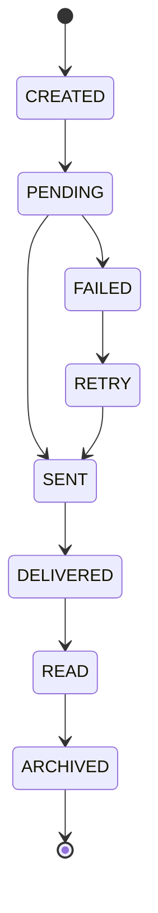

# State Diagram

Project

BusZ - Intercity Bus Ticket Booking Platform

Module

Diagrams

Document ID

DIA-009

Priority

Critical

Version

1.0

---

# 1. Purpose

State Diagram mô tả vòng đời trạng thái của các đối tượng quan trọng trong hệ thống BusZ.

Mục tiêu

- Làm rõ trạng thái nghiệp vụ
- Tránh sai lệch khi xử lý backend
- Hỗ trợ kiểm thử
- Hỗ trợ AI Code Generation
- Đảm bảo dữ liệu nhất quán

---

# 2. Covered State Models

```text
Booking State

Payment State

Ticket State

Seat State

Trip State

Refund State

Notification State
```

---

# 3. Booking State



---

# 4. Booking Status

```text
DRAFT

PENDING_PAYMENT

PAID

CONFIRMED

CHECKED_IN

COMPLETED

CANCELLED

REFUNDED

EXPIRED
```

---

# 5. Payment State



---

# 6. Payment Status

```text
CREATED

PENDING

PROCESSING

SUCCESS

FAILED

CANCELLED

EXPIRED

REFUNDED

PARTIALLY_REFUNDED
```

---

# 7. Ticket State



---

# 8. Ticket Status

```text
CREATED

ISSUED

READY

CHECKED_IN

BOARDING

COMPLETED

CANCELLED

REFUNDED

EXPIRED
```

---

# 9. Seat State



---

# 10. Seat Status

```text
AVAILABLE

SELECTED

HELD

BOOKED

CHECKED_IN

COMPLETED

BLOCKED

MAINTENANCE
```

---

# 11. Trip State



---

# 12. Trip Status

```text
DRAFT

OPEN_BOOKING

READY

BOARDING

DEPARTED

IN_TRANSIT

ARRIVED

COMPLETED

CANCELLED

DELAYED
```

---

# 13. Refund State



---

# 14. Refund Status

```text
REQUESTED

REVIEWING

APPROVED

REJECTED

PROCESSING

SUCCESS

FAILED
```

---

# 15. Notification State



---

# 16. Notification Status

```text
CREATED

PENDING

SENT

DELIVERED

READ

FAILED

RETRY

ARCHIVED
```

---

# 17. Invalid Transitions

Không cho phép

```text
COMPLETED → CANCELLED

REFUNDED → PAID

FAILED PAYMENT → SUCCESS without retry

CANCELLED TICKET → CHECKED_IN

COMPLETED TRIP → EDITED

BOOKED SEAT → AVAILABLE without cancellation
```

---

# 18. Business Rules

```text
Booking chỉ chuyển sang PAID khi Payment SUCCESS.

Ticket chỉ được tạo sau Payment SUCCESS.

Seat HELD hết hạn phải chuyển về AVAILABLE.

Ticket CANCELLED không được Check-in.

Trip COMPLETED không được chỉnh sửa.

Refund chỉ áp dụng cho Booking đã thanh toán.
```

---

# 19. Backend Enforcement

Backend phải kiểm tra

```text
Current Status

Target Status

Allowed Transition

User Permission

Business Rule

Audit Log
```

---

# 20. Database Requirements

Mỗi bảng trạng thái cần có

```text
status

created_at

updated_at

status_changed_at

status_changed_by
```

---

# 21. Audit Logs

Ghi nhận

```text
Old Status

New Status

Changed By

Changed At

Reason

Source
```

---

# 22. Testing Requirements

Phải test

```text
Valid Transition

Invalid Transition

Expired State

Cancelled State

Refunded State

Completed State
```

---

# 23. Acceptance Criteria

✓ Booking State đầy đủ

✓ Payment State đầy đủ

✓ Ticket State đầy đủ

✓ Seat State đầy đủ

✓ Trip State đầy đủ

✓ Refund State đầy đủ

✓ Invalid Transition rõ ràng

✓ Mermaid Diagram hợp lệ

---

# 24. Related Documents

Activity Diagram

Sequence Diagram

Booking API

Payment API

Ticket API

Seat API

Trip API

Business Rules

---

# 25. Summary

State Diagram mô tả vòng đời trạng thái của các đối tượng nghiệp vụ quan trọng trong BusZ như Booking, Payment, Ticket, Seat, Trip, Refund và Notification. Tài liệu này giúp Backend, QA và AI hiểu rõ trạng thái hợp lệ, trạng thái không hợp lệ và quy tắc chuyển trạng thái để tránh lỗi nghiệp vụ trong quá trình triển khai.