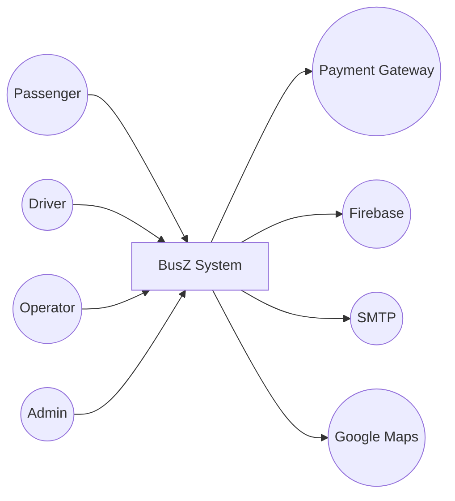
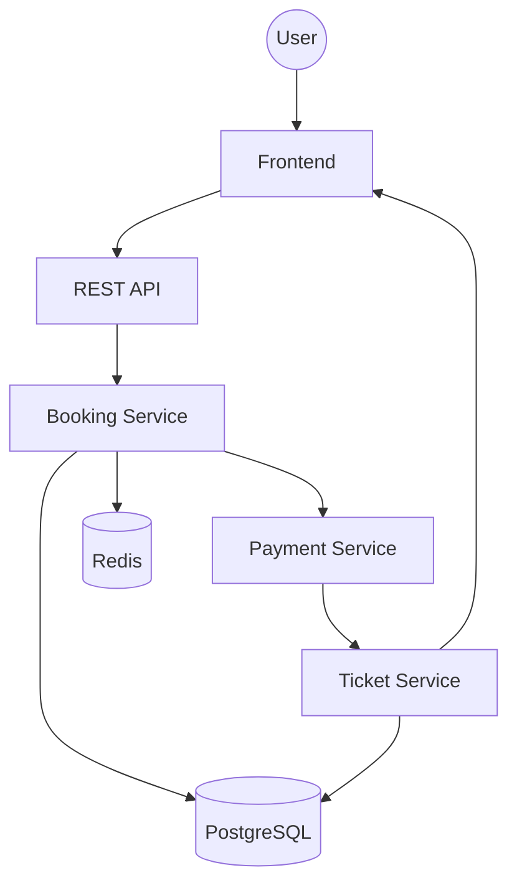

# Data Flow Diagram (DFD)

Project

BusZ - Intercity Bus Ticket Booking Platform

Module

Diagrams

Document ID

DIA-010

Priority

Critical

Version

1.0

---

# 1. Purpose

Data Flow Diagram (DFD) mô tả cách dữ liệu được tạo, xử lý, lưu trữ và truyền giữa các thành phần trong hệ thống BusZ.

Mục tiêu

- Hiểu luồng dữ liệu
- Thiết kế Data Pipeline
- Hỗ trợ Backend
- Hỗ trợ Database Design
- Hỗ trợ AI Code Generation

---

# 2. Data Flow Overview

```text
User

↓

Frontend

↓

REST API

↓

Business Services

↓

Database

↓

External Services
```

---

# 3. External Entities

```text
Passenger

Driver

Operator

Admin

Payment Gateway

Firebase

Email Service

SMS Gateway

Google Maps
```

---

# 4. Processes

```text
Authentication

Search

Booking

Seat Management

Payment

Ticket

Notification

Review

Administration
```

---

# 5. Data Stores

```text
Users

Companies

Drivers

Vehicles

Routes

Trips

Seats

Bookings

Passengers

Payments

Tickets

Reviews

Notifications

Audit Logs

Redis Cache
```

---

# 6. Level 0 DFD



---

# 7. Level 1 DFD



---

# 8. Authentication Data Flow

```text
User

↓

Login Request

↓

Authentication Service

↓

Validate Credentials

↓

Generate JWT

↓

Return Token
```

---

# 9. Search Data Flow

```text
Passenger

↓

Search Request

↓

Search Service

↓

Trip Database

↓

Search Result
```

---

# 10. Booking Data Flow

```text
Passenger

↓

Select Trip

↓

Select Seat

↓

Booking Service

↓

Booking Database
```

---

# 11. Seat Management Data Flow

```text
Passenger

↓

Seat Selection

↓

Seat Service

↓

Redis Hold

↓

Booking Confirmation
```

---

# 12. Payment Data Flow

```text
Passenger

↓

Payment Request

↓

Payment Gateway

↓

Webhook

↓

Payment Service

↓

Booking Update
```

---

# 13. Ticket Data Flow

```text
Payment Success

↓

Generate Ticket

↓

Generate QR

↓

Save Database

↓

Return Ticket
```

---

# 14. Notification Data Flow

```text
Business Event

↓

Notification Service

↓

Push

↓

Email

↓

SMS

↓

User
```

---

# 15. Driver Check-in Flow

```text
Driver

↓

Scan QR

↓

Ticket Validation

↓

Update Booking

↓

Database
```

---

# 16. Refund Data Flow

```text
Passenger

↓

Refund Request

↓

Refund Validation

↓

Payment Gateway

↓

Refund Status

↓

Booking Update
```

---

# 17. Admin Data Flow

```text
Dashboard

↓

Statistics

↓

Reports

↓

Analytics Database
```

---

# 18. Database Flow

```text
API

↓

CRUD

↓

PostgreSQL

↓

Response
```

---

# 19. Cache Flow

```text
API

↓

Redis

↓

Cached Data

↓

API Response
```

---

# 20. External Service Flow

```text
Payment Gateway

Firebase

SMTP

SMS Gateway

Google Maps
```

---

# 21. Logging Flow

```text
API Request

↓

Logger

↓

Audit Log

↓

Monitoring
```

---

# 22. Error Flow

```text
Request

↓

Validation

↓

Business Error

↓

Error Response
```

---

# 23. Security Flow

```text
HTTPS

↓

JWT

↓

Authorization

↓

Business Service
```

---

# 24. Data Lifecycle

```text
Create

↓

Read

↓

Update

↓

Archive

↓

Delete
```

---

# 25. Acceptance Criteria

✓ Level 0 DFD đầy đủ

✓ Level 1 DFD đầy đủ

✓ Data Stores rõ ràng

✓ External Entities đầy đủ

✓ Data Flow hợp lệ

✓ Mermaid Diagram hoạt động

---

# 26. Related Documents

System Overview

ER Diagram

Component Diagram

Sequence Diagram

Database Schema

API Specification

---

# 27. Summary

Data Flow Diagram mô tả cách dữ liệu di chuyển trong toàn bộ hệ thống BusZ từ người dùng, Frontend, Backend, Database đến các dịch vụ bên ngoài. Tài liệu này giúp đội phát triển hiểu rõ luồng xử lý dữ liệu, tối ưu thiết kế hệ thống và hỗ trợ AI sinh mã nguồn chính xác.