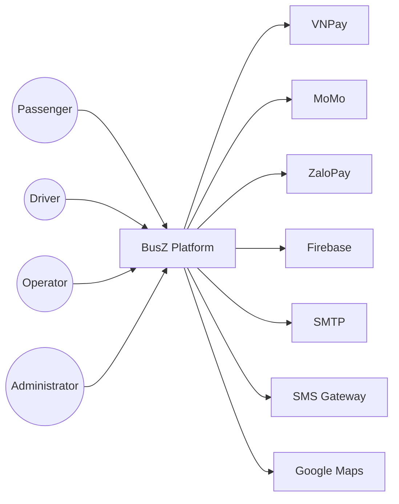

# C4 Context Diagram

Project

BusZ - Intercity Bus Ticket Booking Platform

Module

Diagrams

Document ID

DIA-011

Priority

Critical

Version

1.0

---

# 1. Purpose

C4 Context Diagram mô tả BusZ ở mức cao nhất trong mô hình C4, thể hiện mối quan hệ giữa hệ thống và các tác nhân, cũng như các hệ thống bên ngoài.

Mục tiêu

- Hiểu phạm vi hệ thống
- Xác định Actor
- Xác định External Systems
- Hỗ trợ Solution Architecture
- Hỗ trợ AI Code Generation

---

# 2. Scope

BusZ bao gồm

```text
Passenger App

Driver App

Operator Portal

Admin Portal

Backend API
```

---

# 3. Primary Actors

```text
Passenger

Driver

Operator

Administrator

Super Administrator
```

---

# 4. External Systems

```text
VNPay

MoMo

ZaloPay

Firebase Cloud Messaging

SMTP Email

SMS Gateway

Google Maps

OpenStreetMap
```

---

# 5. Context Diagram



---

# 6. Passenger Responsibilities

```text
Register

Login

Search Trip

Book Ticket

Pay

View Ticket

Cancel Booking

Review Trip
```

---

# 7. Driver Responsibilities

```text
Login

View Assigned Trips

View Passenger List

Scan QR

Check-in Passenger

Update Trip Status
```

---

# 8. Operator Responsibilities

```text
Manage Trips

Manage Drivers

Manage Vehicles

Manage Schedules

View Revenue
```

---

# 9. Administrator Responsibilities

```text
Manage Users

Manage Routes

Manage Operators

Manage Promotions

View Reports

System Monitoring
```

---

# 10. Payment Gateway

Vai trò

```text
Receive Payment

Verify Payment

Return Result

Refund
```

---

# 11. Notification Services

```text
Push Notification

Email

SMS
```

---

# 12. Map Services

```text
Route Display

Pickup Point

Dropoff Point

GPS

Distance
```

---

# 13. Data Exchange

Passenger

```text
Booking Request

Payment Request

Ticket Request
```

Backend

```text
JSON REST API

HTTPS

JWT
```

External

```text
Webhook

Push Notification

SMTP

HTTPS
```

---

# 14. Security Boundary

```text
Internet

↓

HTTPS

↓

API Gateway

↓

Backend

↓

Database
```

---

# 15. Trust Boundary

Internal

```text
Backend

Database

Redis
```

External

```text
Payment Gateway

Firebase

SMTP

Google Maps
```

---

# 16. Business Capabilities

```text
Authentication

Booking

Payment

Ticket

Notification

Reporting

Administration
```

---

# 17. Acceptance Criteria

✓ Actors đầy đủ

✓ External Systems đầy đủ

✓ Mermaid Diagram hợp lệ

✓ Trust Boundary rõ ràng

✓ Context đúng C4 Model

---

# 18. Related Documents

C4 Container

C4 Component

Deployment Diagram

Component Diagram

System Architecture

---

# 19. Summary

C4 Context Diagram mô tả BusZ như một hệ thống hoàn chỉnh và các tương tác với người dùng cũng như các hệ thống bên ngoài. Đây là mức đầu tiên của mô hình C4 và là cơ sở để phát triển các sơ đồ C4 Container và C4 Component chi tiết hơn.