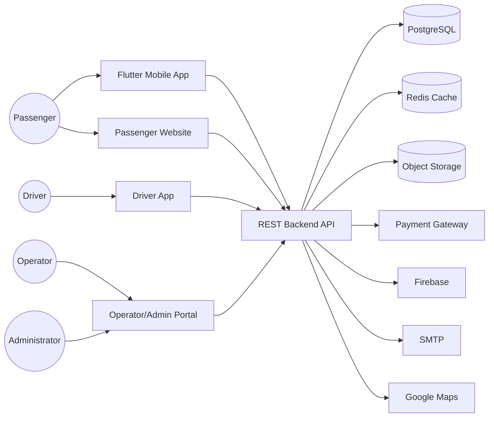

# C4 Container Diagram

Project

BusZ - Intercity Bus Ticket Booking Platform

Module

Diagrams

Document ID

DIA-012

Priority

Critical

Version

1.0

---

# 1. Purpose

C4 Container Diagram mô tả kiến trúc của BusZ ở mức Container theo mô hình C4. Tài liệu này thể hiện cách các ứng dụng, dịch vụ và cơ sở dữ liệu tương tác với nhau.

Mục tiêu

- Mô tả kiến trúc triển khai
- Phân tách Frontend và Backend
- Mô tả Data Store
- Mô tả External Services
- Hỗ trợ DevOps
- Hỗ trợ AI Code Generation

---

# 2. Containers

```text
Flutter Mobile App

Passenger Website

Driver App

Operator Portal

Admin Portal

Backend API

PostgreSQL

Redis

Object Storage
```

---

# 3. External Systems

```text
VNPay

MoMo

ZaloPay

Firebase

SMTP

SMS Gateway

Google Maps
```

---

# 4. C4 Container Diagram



---

# 5. Mobile Application

Technology

```text
Flutter
```

Responsibilities

```text
Authentication

Search Trip

Booking

Payment

Ticket

Profile

Notification
```

---

# 6. Passenger Website

Technology

```text
React

TypeScript

Vite
```

Responsibilities

```text
Search

Booking

Payment

Manage Booking

Support
```

---

# 7. Driver Application

Technology

```text
Flutter
```

Responsibilities

```text
Trip List

Passenger List

QR Check-in

Trip Status

Notifications
```

---

# 8. Admin Portal

Technology

```text
React

TypeScript

Material UI
```

Responsibilities

```text
Dashboard

CRUD

Reports

Revenue

System Configuration
```

---

# 9. Backend API

Technology

```text
Node.js

Express/NestJS

Prisma ORM
```

Responsibilities

```text
Authentication

Business Logic

Validation

Authorization

Integration
```

---

# 10. PostgreSQL

Stores

```text
Users

Bookings

Payments

Tickets

Trips

Routes

Reviews

Notifications

Audit Logs
```

---

# 11. Redis

Stores

```text
Session

JWT

OTP

Seat Hold

Rate Limit

Search Cache
```

---

# 12. Object Storage

Stores

```text
Avatar

Ticket PDF

Vehicle Images

Review Images

Operator Documents
```

---

# 13. Payment Gateway

Responsibilities

```text
Payment

Refund

Webhook

Transaction Verification
```

---

# 14. Notification Services

```text
Firebase Push

SMTP Email

SMS Gateway
```

---

# 15. Communication

Frontend

↓

Backend

```text
HTTPS REST API

JSON

JWT
```

Backend

↓

Payment

```text
HTTPS

Webhook
```

Backend

↓

Database

```text
SQL

Prisma ORM
```

---

# 16. Security

```text
HTTPS

JWT

RBAC

Rate Limiting

Input Validation

Encryption
```

---

# 17. Deployment

```text
Docker

Kubernetes

Load Balancer

Horizontal Scaling
```

---

# 18. Container Responsibilities

| Container | Responsibility |
|-----------|----------------|
| Flutter | Passenger Mobile |
| React Website | Passenger Web |
| Driver App | Driver Operations |
| Admin Portal | Administration |
| Backend API | Business Logic |
| PostgreSQL | Persistent Data |
| Redis | Cache |
| Object Storage | Files |
| Payment Gateway | Online Payment |

---

# 19. Acceptance Criteria

✓ Containers xác định rõ

✓ Data Store đầy đủ

✓ External Services đầy đủ

✓ Mermaid Diagram hợp lệ

✓ Theo chuẩn C4 Model

---

# 20. Related Documents

C4 Context

C4 Component

Deployment Diagram

Component Diagram

Infrastructure

---

# 21. Summary

C4 Container Diagram mô tả kiến trúc BusZ ở mức Container, thể hiện các ứng dụng, dịch vụ và cơ sở dữ liệu cũng như cách chúng tương tác với nhau. Đây là tài liệu quan trọng để triển khai hệ thống theo kiến trúc hiện đại và hỗ trợ AI hiểu đúng ranh giới giữa các thành phần.