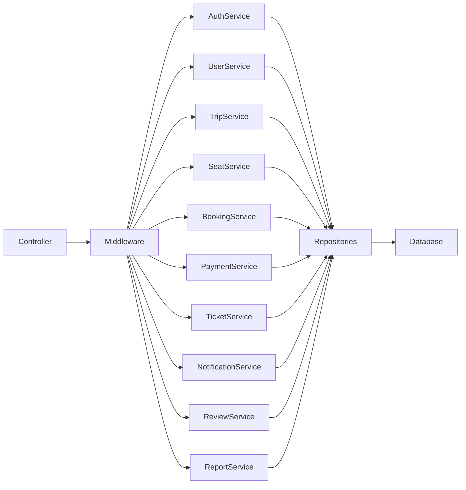

# C4 Component Diagram

Project

BusZ - Intercity Bus Ticket Booking Platform

Module

Diagrams

Document ID

DIA-013

Priority

Critical

Version

1.0

---

# 1. Purpose

C4 Component Diagram mô tả cấu trúc bên trong Backend API của BusZ theo mô hình C4 Level 3.

Mục tiêu

- Mô tả các Component nội bộ
- Thể hiện Dependency giữa các Module
- Hỗ trợ Clean Architecture
- Hỗ trợ AI Code Generation
- Hỗ trợ bảo trì hệ thống

---

# 2. Backend Architecture

```text
Controller

↓

Middleware

↓

Service

↓

Repository

↓

Database
```

---

# 3. Main Components

```text
Authentication

User

Company

Driver

Vehicle

Route

Trip

Seat

Booking

Passenger

Payment

Ticket

Promotion

Notification

Review

Report

Audit
```

---

# 4. Authentication Component

Responsibilities

```text
Register

Login

Refresh Token

JWT

RBAC

Password Reset

OTP
```

---

# 5. Booking Component

Responsibilities

```text
Booking Validation

Seat Reservation

Booking Creation

Booking Cancellation

Booking History
```

---

# 6. Payment Component

Responsibilities

```text
Create Payment

Verify Payment

Webhook

Refund

Invoice
```

---

# 7. Ticket Component

Responsibilities

```text
Generate QR

Generate PDF

Download Ticket

Validate Ticket

Check-in
```

---

# 8. Notification Component

Responsibilities

```text
Push Notification

Email

SMS

Reminder

System Notification
```

---

# 9. Review Component

Responsibilities

```text
Create Review

Update Review

Delete Review

Operator Reply
```

---

# 10. Report Component

Responsibilities

```text
Revenue Report

Trip Report

Booking Report

Passenger Report

Financial Report
```

---

# 11. Repository Layer

```text
UserRepository

BookingRepository

TripRepository

SeatRepository

PaymentRepository

TicketRepository

NotificationRepository

ReviewRepository
```

---

# 12. Infrastructure Layer

```text
PostgreSQL

Redis

Storage

Payment Gateway

Firebase

SMTP

Google Maps
```

---

# 13. Component Diagram



---

# 14. Booking Dependencies

```text
Booking Service

↓

Trip Service

↓

Seat Service

↓

Payment Service

↓

Ticket Service

↓

Notification Service
```

---

# 15. Authentication Dependencies

```text
JWT

↓

Role

↓

Permission

↓

User Repository
```

---

# 16. Payment Dependencies

```text
Booking

↓

Payment Gateway

↓

Webhook

↓

Ticket

↓

Notification
```

---

# 17. Notification Dependencies

```text
Firebase

SMTP

SMS Gateway
```

---

# 18. Component Communication

```text
REST API

↓

Service

↓

Repository

↓

Database
```

---

# 19. Design Patterns

```text
Service Layer

Repository Pattern

Dependency Injection

Factory Pattern

Strategy Pattern

Observer Pattern
```

---

# 20. SOLID Principles

```text
Single Responsibility

Open Closed

Liskov Substitution

Interface Segregation

Dependency Inversion
```

---

# 21. Error Handling

```text
Validation Error

Business Error

Infrastructure Error

Payment Error

Unexpected Error
```

---

# 22. Logging

```text
Access Log

Business Log

Audit Log

Security Log

Payment Log
```

---

# 23. Monitoring

```text
API Response Time

Booking Success

Payment Success

Ticket Generation

Notification Delivery
```

---

# 24. Security

```text
HTTPS

JWT

RBAC

Input Validation

Rate Limiting

Audit Trail
```

---

# 25. Scalability

```text
Stateless Services

Horizontal Scaling

Redis Cache

Queue Processing

Read Replica
```

---

# 26. Acceptance Criteria

✓ Component chia rõ ràng

✓ Dependency hợp lý

✓ Mermaid Diagram hợp lệ

✓ Clean Architecture

✓ AI có thể sinh Service Layer

✓ Repository Layer rõ ràng

---

# 27. Related Documents

C4 Context

C4 Container

Component Diagram

Class Diagram

Deployment Diagram

API Specification

Database Schema

---

# 28. Summary

C4 Component Diagram mô tả chi tiết cấu trúc nội bộ của Backend BusZ theo chuẩn C4 Level 3. Các thành phần như Controller, Middleware, Service, Repository và Database được phân tách rõ ràng, giúp hệ thống dễ mở rộng, dễ bảo trì và hỗ trợ hiệu quả cho AI trong việc sinh mã nguồn theo kiến trúc Clean Architecture hoặc Modular Monolith.