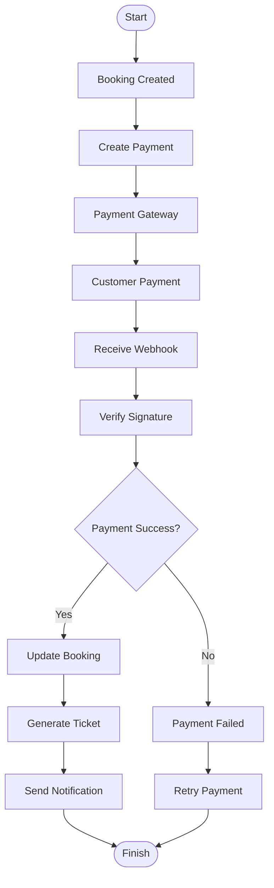

# Payment Flow Diagram

Project

BusZ - Intercity Bus Ticket Booking Platform

Module

Diagrams

Document ID

DIA-015

Priority

Critical

Version

1.0

---

# 1. Purpose

Payment Flow mô tả toàn bộ quy trình thanh toán của BusZ từ lúc tạo giao dịch đến khi phát hành vé điện tử.

Mục tiêu

- Chuẩn hóa quy trình thanh toán
- Hỗ trợ Backend Development
- Hỗ trợ QA
- Hỗ trợ tích hợp Payment Gateway
- Hỗ trợ AI Code Generation

---

# 2. Supported Payment Methods

```text
VNPay

MoMo

ZaloPay

Credit Card

Bank Transfer
```

---

# 3. Payment Flow Overview

```text
Create Booking

↓

Create Payment

↓

Redirect Gateway

↓

Customer Payment

↓

Webhook

↓

Verify Signature

↓

Update Booking

↓

Generate Ticket

↓

Notification
```

---

# 4. Payment Flow Diagram



---

# 5. Payment Request Flow

```text
Passenger

↓

Create Payment

↓

Backend API

↓

Payment Gateway

↓

Payment URL
```

---

# 6. Customer Payment Flow

```text
Payment Page

↓

Authentication

↓

Payment Confirmation

↓

Gateway Processing

↓

Payment Result
```

---

# 7. Webhook Flow

```text
Gateway

↓

Webhook

↓

Verify Signature

↓

Update Payment

↓

Update Booking

↓

Generate Ticket
```

---

# 8. Payment Validation

Kiểm tra

```text
Booking Exists

Booking Status

Payment Amount

Currency

Signature

Transaction ID
```

---

# 9. Payment Status

```text
CREATED

PENDING

PROCESSING

SUCCESS

FAILED

EXPIRED

CANCELLED

REFUNDED
```

---

# 10. Successful Payment Flow

```text
Payment Success

↓

Update Payment

↓

Update Booking

↓

Generate Ticket

↓

Send Notification
```

---

# 11. Failed Payment Flow

```text
Payment Failed

↓

Keep Booking Pending

↓

Allow Retry

↓

Release Seat After Timeout
```

---

# 12. Timeout Flow

```text
Payment Pending

↓

No Callback

↓

Booking Expired

↓

Release Seat
```

---

# 13. Refund Flow

```text
Refund Request

↓

Refund Validation

↓

Gateway Refund

↓

Update Payment

↓

Update Booking

↓

Notification
```

---

# 14. Duplicate Callback Flow

```text
Receive Webhook

↓

Check Transaction ID

↓

Already Processed?

↓

Ignore Duplicate
```

---

# 15. Database Updates

```text
Payments

Bookings

Tickets

Audit Logs

Notifications
```

---

# 16. Security

```text
HTTPS

Webhook Signature

JWT

Audit Log

Replay Protection

Idempotency Key
```

---

# 17. Error Handling

```text
Gateway Timeout

Invalid Signature

Network Failure

Duplicate Callback

Database Failure
```

---

# 18. Performance Targets

```text
Create Payment <500 ms

Webhook <300 ms

Booking Update <200 ms

Ticket Generation <1 Second
```

---

# 19. Monitoring

Theo dõi

```text
Payment Success Rate

Payment Failure Rate

Gateway Latency

Webhook Errors

Refund Success Rate
```

---

# 20. Business Rules

```text
Một Booking chỉ có một Payment thành công.

Không phát hành Ticket trước khi Payment SUCCESS.

Webhook phải được xác thực.

Duplicate Callback không được tạo Ticket lần hai.

Refund chỉ áp dụng với Booking hợp lệ.
```

---

# 21. Acceptance Criteria

✓ Payment Flow đầy đủ

✓ Webhook Flow đầy đủ

✓ Refund Flow đầy đủ

✓ Duplicate Callback được xử lý

✓ Mermaid Diagram hợp lệ

✓ Business Rules chính xác

---

# 22. Related Documents

Booking Flow

Refund Flow

Payment API

Sequence Diagram

State Diagram

Business Rules

---

# 23. Summary

Payment Flow Diagram mô tả toàn bộ quy trình thanh toán của BusZ từ tạo giao dịch, xử lý tại cổng thanh toán, xác thực webhook, cập nhật trạng thái Booking, phát hành Ticket và gửi thông báo. Tài liệu này giúp đảm bảo quy trình thanh toán an toàn, chính xác và tránh các lỗi như callback trùng lặp hoặc phát hành vé sai trạng thái.