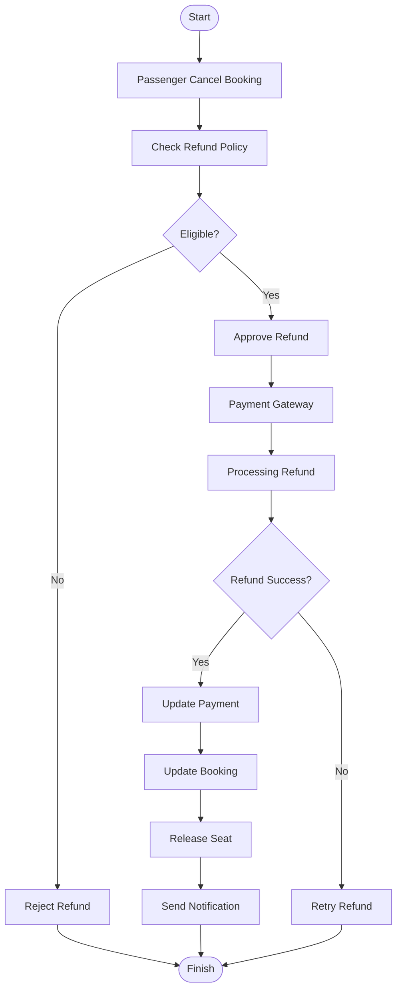

# Refund Flow Diagram

Project

BusZ - Intercity Bus Ticket Booking Platform

Module

Diagrams

Document ID

DIA-016

Priority

Critical

Version

1.0

---

# 1. Purpose

Refund Flow mô tả toàn bộ quy trình hoàn tiền trong hệ thống BusZ từ khi hành khách gửi yêu cầu hoàn vé đến khi giao dịch hoàn tiền hoàn tất.

Mục tiêu

- Chuẩn hóa quy trình Refund
- Hỗ trợ Backend
- Hỗ trợ QA
- Hỗ trợ Payment Gateway
- Hỗ trợ AI Code Generation

---

# 2. Refund Overview

```text
Cancel Booking

↓

Validate Policy

↓

Approve Refund

↓

Gateway Refund

↓

Update Database

↓

Notification
```

---

# 3. Refund Flow Diagram



---

# 4. Refund Request

```text
Passenger

↓

Booking History

↓

Cancel Booking

↓

Refund Request
```

---

# 5. Refund Validation

Kiểm tra

```text
Booking Status

Payment Status

Departure Time

Refund Policy

Operator Rules

Promotion Rules
```

---

# 6. Refund Policy

Ví dụ

```text
>24 Hours

100%

12–24 Hours

70%

2–12 Hours

50%

<2 Hours

0%
```

---

# 7. Approval Flow

```text
Refund Request

↓

Automatic Validation

↓

Manual Approval (Optional)

↓

Gateway Refund
```

---

# 8. Gateway Refund

```text
Create Refund

↓

Gateway Verification

↓

Transfer Money

↓

Refund Callback
```

---

# 9. Refund Status

```text
REQUESTED

VALIDATING

APPROVED

PROCESSING

SUCCESS

FAILED

REJECTED
```

---

# 10. Successful Refund

```text
Payment

↓

Refund Success

↓

Booking Refunded

↓

Seat Released

↓

Customer Notification
```

---

# 11. Failed Refund

```text
Refund Failed

↓

Retry

↓

Manual Processing

↓

Customer Notification
```

---

# 12. Database Updates

```text
Payments

Refunds

Bookings

Seats

Audit Logs

Notifications
```

---

# 13. Seat Recovery

```text
Refund Success

↓

Release Seat

↓

Available Again
```

---

# 14. Notification Flow

```text
Refund Approved

↓

Push

↓

Email

↓

SMS
```

---

# 15. Security

```text
HTTPS

Webhook Verification

Refund Authorization

Audit Log

Transaction Validation
```

---

# 16. Business Rules

```text
Refund chỉ áp dụng cho Booking đã thanh toán.

Không hoàn tiền cho Booking đã Completed.

Không hoàn tiền sau thời gian quy định.

Một Payment chỉ được Refund đúng số tiền hợp lệ.

Duplicate Refund bị từ chối.
```

---

# 17. Error Handling

```text
Gateway Error

Database Error

Network Timeout

Duplicate Refund

Refund Limit Exceeded
```

---

# 18. Monitoring

```text
Refund Success Rate

Refund Failure Rate

Average Refund Time

Pending Refund

Manual Refund
```

---

# 19. Performance Targets

```text
Refund Validation <300 ms

Gateway Refund <5 Seconds

Database Update <300 ms

Notification <2 Seconds
```

---

# 20. Acceptance Criteria

✓ Refund Flow đầy đủ

✓ Refund Policy rõ ràng

✓ Seat Recovery chính xác

✓ Mermaid Diagram hợp lệ

✓ Gateway Integration đúng

✓ Business Rules đầy đủ

---

# 21. Related Documents

Booking Flow

Payment Flow

Refund API

State Diagram

Sequence Diagram

Business Rules

---

# 22. Summary

Refund Flow Diagram mô tả quy trình hoàn tiền của BusZ từ lúc hành khách yêu cầu hoàn vé, kiểm tra điều kiện hoàn tiền, xử lý qua cổng thanh toán, cập nhật trạng thái Booking và Payment, giải phóng ghế và gửi thông báo đến khách hàng. Tài liệu đảm bảo quy trình hoàn tiền minh bạch, chính xác và an toàn.