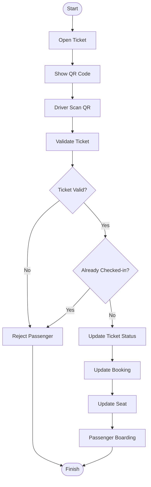

# Check-in Flow Diagram

Project

BusZ - Intercity Bus Ticket Booking Platform

Module

Diagrams

Document ID

DIA-017

Priority

Critical

Version

1.0

---

# 1. Purpose

Check-in Flow mô tả quy trình kiểm tra vé điện tử và xác nhận hành khách lên xe.

Mục tiêu

- Chuẩn hóa quy trình Check-in
- Ngăn chặn vé giả
- Ngăn chặn Check-in nhiều lần
- Đồng bộ trạng thái chuyến xe
- Hỗ trợ AI Code Generation

---

# 2. Check-in Overview

```text
Passenger

↓

Show QR Ticket

↓

Driver Scan

↓

Validate Ticket

↓

Check Booking

↓

Update Status

↓

Board Bus
```

---

# 3. Check-in Flow Diagram



---

# 4. Passenger Flow

```text
Open App

↓

Open Ticket

↓

Display QR

↓

Present QR

↓

Board Bus
```

---

# 5. Driver Flow

```text
Login

↓

View Assigned Trip

↓

Open Scanner

↓

Scan QR

↓

Confirm Check-in
```

---

# 6. QR Validation

Kiểm tra

```text
Ticket Exists

Booking Exists

Trip Exists

Trip Active

QR Signature

Expiration

Ticket Status
```

---

# 7. Booking Validation

Kiểm tra

```text
Booking Paid

Booking Confirmed

Not Cancelled

Not Refunded

Passenger Exists
```

---

# 8. Seat Validation

```text
Seat Assigned

↓

Seat Available

↓

Seat Occupied
```

---

# 9. Ticket Status

```text
ISSUED

↓

READY

↓

CHECKED_IN

↓

BOARDING

↓

COMPLETED
```

---

# 10. Booking Status

```text
CONFIRMED

↓

CHECKED_IN

↓

COMPLETED
```

---

# 11. Trip Status Validation

```text
OPEN

READY

BOARDING

DEPARTED
```

Không cho phép

```text
CANCELLED

COMPLETED
```

---

# 12. Failure Scenarios

```text
QR Invalid

QR Expired

Booking Cancelled

Payment Failed

Ticket Refunded

Wrong Trip

Already Checked-in
```

---

# 13. Recovery Flow

```text
Manual Verification

↓

Admin Approval

↓

Manual Check-in
```

---

# 14. Offline Mode

Cho phép

```text
Offline QR Cache

Offline Validation

Sync Later
```

---

# 15. Database Updates

```text
Tickets

Bookings

Seats

Trips

Audit Logs
```

---

# 16. Notifications

```text
Passenger Checked-in

↓

Push Notification

↓

Operator Dashboard

↓

Admin Dashboard
```

---

# 17. Security

```text
Encrypted QR

JWT

HTTPS

QR Signature

Replay Protection

Audit Log
```

---

# 18. Monitoring

Theo dõi

```text
Check-in Success

Failed Scan

Duplicate Scan

Average Scan Time

Offline Check-in
```

---

# 19. Performance Targets

```text
QR Scan <1 Second

Validation <300 ms

Database Update <200 ms

Notification <2 Seconds
```

---

# 20. Business Rules

```text
Một vé chỉ được Check-in một lần.

Chỉ Driver của chuyến xe được phép Check-in.

Không Check-in vé đã Refund.

Không Check-in vé đã Cancel.

Không Check-in sau khi Trip Completed.
```

---

# 21. Acceptance Criteria

✓ QR Validation đầy đủ

✓ Duplicate Check-in được xử lý

✓ Offline Mode hỗ trợ

✓ Mermaid Diagram hợp lệ

✓ Database cập nhật chính xác

✓ Business Rules đầy đủ

---

# 22. Related Documents

Booking Flow

Payment Flow

Refund Flow

Ticket API

Trip API

State Diagram

Sequence Diagram

---

# 23. Summary

Check-in Flow Diagram mô tả toàn bộ quy trình xác thực vé điện tử của BusZ, từ lúc hành khách xuất trình mã QR, tài xế quét mã, hệ thống xác minh tính hợp lệ của vé, cập nhật trạng thái Booking, Ticket và Seat cho đến khi hành khách hoàn tất lên xe. Tài liệu giúp đảm bảo quy trình Check-in an toàn, chính xác và chống gian lận.