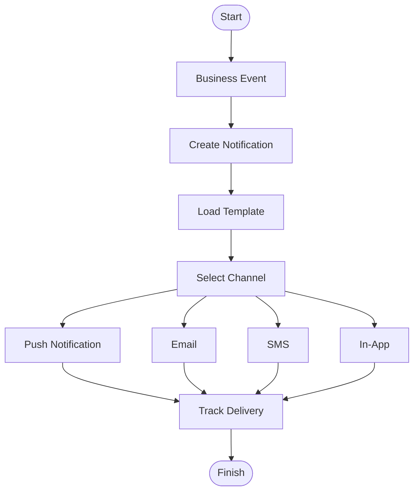

# Notification Flow Diagram

Project

BusZ - Intercity Bus Ticket Booking Platform

Module

Diagrams

Document ID

DIA-018

Priority

High

Version

1.0

---

# 1. Purpose

Notification Flow mô tả toàn bộ quy trình gửi thông báo trong BusZ từ khi phát sinh sự kiện nghiệp vụ đến khi người dùng nhận được thông báo.

Mục tiêu

- Chuẩn hóa Notification Service
- Hỗ trợ Push Notification
- Hỗ trợ Email
- Hỗ trợ SMS
- Hỗ trợ AI Code Generation

---

# 2. Notification Channels

```text
Push Notification

Email

SMS

In-App Notification
```

---

# 3. Trigger Events

```text
User Registration

Booking Created

Booking Confirmed

Payment Success

Payment Failed

Refund Approved

Refund Rejected

Trip Updated

Trip Cancelled

Driver Assigned

Promotion

System Announcement
```

---

# 4. Notification Flow Overview

```text
Business Event

↓

Notification Service

↓

Template Engine

↓

Channel Selection

↓

Delivery

↓

Tracking
```

---

# 5. Notification Flow Diagram



---

# 6. Booking Notification

```text
Booking Created

↓

Booking Confirmed

↓

Ticket Generated

↓

Push + Email
```

---

# 7. Payment Notification

```text
Payment Success

↓

Ticket Ready

↓

Push

↓

Email
```

Payment Failed

```text
Payment Failed

↓

Retry Reminder
```

---

# 8. Refund Notification

```text
Refund Requested

↓

Refund Approved

↓

Refund Completed

↓

Customer Notification
```

---

# 9. Trip Notification

```text
Trip Delayed

↓

Trip Cancelled

↓

Gate Changed

↓

Departure Reminder
```

---

# 10. Driver Notification

```text
Trip Assigned

↓

Schedule Updated

↓

Passenger List Updated
```

---

# 11. Admin Notification

```text
Payment Failure

Booking Failure

System Error

Security Alert

Infrastructure Alert
```

---

# 12. Template Engine

```text
Booking Template

Payment Template

Refund Template

Promotion Template

Reminder Template
```

---

# 13. Delivery Status

```text
CREATED

QUEUED

SENDING

SENT

DELIVERED

READ

FAILED
```

---

# 14. Retry Strategy

```text
Retry 1

↓

Retry 2

↓

Retry 3

↓

Mark Failed
```

---

# 15. Database Updates

```text
Notifications

Notification Logs

Delivery Status

Read Status
```

---

# 16. External Services

```text
Firebase Cloud Messaging

SMTP

SMS Gateway
```

---

# 17. Security

```text
HTTPS

JWT

Encrypted Payload

Notification Signature

Audit Log
```

---

# 18. Monitoring

```text
Push Success Rate

Email Success Rate

SMS Success Rate

Delivery Time

Failure Rate
```

---

# 19. Performance Targets

```text
Push <2 Seconds

Email <10 Seconds

SMS <15 Seconds

Queue Processing <500 ms
```

---

# 20. Business Rules

```text
Booking Success phải gửi Notification.

Payment Success phải gửi Ticket.

Refund Success phải gửi Email.

Notification lỗi phải Retry.

Một Notification không gửi trùng.
```

---

# 21. Acceptance Criteria

✓ Notification Flow đầy đủ

✓ Push hoạt động

✓ Email hoạt động

✓ SMS hoạt động

✓ Retry Strategy đầy đủ

✓ Mermaid Diagram hợp lệ

---

# 22. Related Documents

Booking Flow

Payment Flow

Refund Flow

Notification API

State Diagram

Sequence Diagram

---

# 23. Summary

Notification Flow Diagram mô tả toàn bộ quy trình tạo, xử lý và gửi thông báo trong BusZ. Hệ thống hỗ trợ nhiều kênh như Push Notification, Email, SMS và In-App Notification, đồng thời đảm bảo khả năng theo dõi trạng thái gửi, tự động Retry khi thất bại và lưu lịch sử phục vụ Audit.