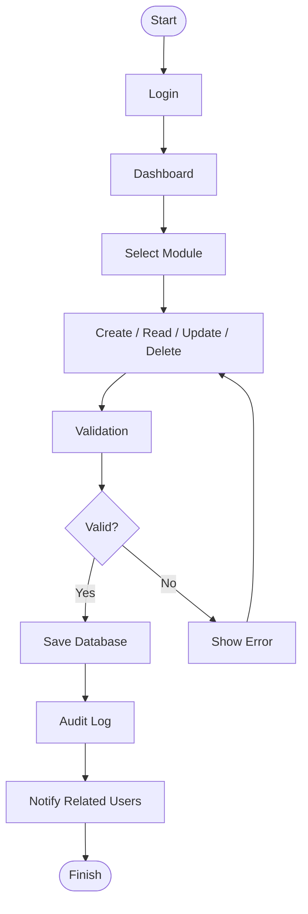

# Admin Workflow Diagram

Project

BusZ - Intercity Bus Ticket Booking Platform

Module

Diagrams

Document ID

DIA-019

Priority

Critical

Version

1.0

---

# 1. Purpose

Admin Workflow mô tả toàn bộ quy trình làm việc của Admin và Operator trong hệ thống BusZ từ đăng nhập đến quản lý dữ liệu và theo dõi vận hành.

Mục tiêu

- Chuẩn hóa nghiệp vụ quản trị
- Hỗ trợ Dashboard
- Hỗ trợ Operation Team
- Hỗ trợ QA
- Hỗ trợ AI Code Generation

---

# 2. Admin Responsibilities

```text
Authentication

Dashboard

User Management

Company Management

Route Management

Trip Management

Vehicle Management

Driver Management

Booking Management

Payment Management

Promotion Management

Notification Management

Reports

System Settings
```

---

# 3. Admin Workflow Overview

```text
Login

↓

Dashboard

↓

Select Module

↓

CRUD Operation

↓

Save

↓

Audit Log

↓

Dashboard Refresh
```

---

# 4. Admin Workflow Diagram



---

# 5. Dashboard Workflow

```text
Login

↓

Load Dashboard

↓

Statistics

↓

Charts

↓

Recent Activities

↓

Alerts
```

---

# 6. User Management

```text
View Users

Create User

Update User

Deactivate User

Reset Password
```

---

# 7. Company Management

```text
Create Company

Update Company

Suspend Company

Restore Company
```

---

# 8. Route Management

```text
Create Route

Update Route

Delete Route

Manage Pickup Points

Manage Dropoff Points
```

---

# 9. Trip Management

```text
Create Trip

Assign Vehicle

Assign Driver

Open Booking

Cancel Trip

Complete Trip
```

---

# 10. Vehicle Management

```text
Create Vehicle

Update Vehicle

Seat Layout

Maintenance

Deactivate Vehicle
```

---

# 11. Driver Management

```text
Add Driver

Update Driver

Assign Trip

Suspend Driver

View Performance
```

---

# 12. Booking Management

```text
Search Booking

View Detail

Cancel Booking

Approve Refund

Export Booking
```

---

# 13. Payment Management

```text
View Transactions

Verify Payment

Refund Payment

Export Report
```

---

# 14. Promotion Management

```text
Create Promotion

Update Promotion

Disable Promotion

Usage Statistics
```

---

# 15. Notification Management

```text
Create Announcement

Send Push

Send Email

Send SMS
```

---

# 16. Report Workflow

```text
Revenue

Bookings

Passengers

Trips

Refunds

Operators
```

---

# 17. Audit Workflow

```text
User Action

↓

Audit Log

↓

Store Database

↓

View History
```

---

# 18. Security

```text
RBAC

Permission Check

JWT

Audit Trail

Two-Factor Authentication (Optional)
```

---

# 19. Error Handling

```text
Permission Denied

Validation Failed

Database Error

Network Error

Duplicate Data
```

---

# 20. Monitoring

```text
Online Users

Bookings Today

Revenue Today

Failed Payments

System Alerts
```

---

# 21. Business Rules

```text
Admin có toàn quyền quản trị.

Operator chỉ quản lý dữ liệu của công ty mình.

Mọi thao tác CRUD phải ghi Audit Log.

Không được xóa dữ liệu đã phát sinh giao dịch.

Chỉ Admin được cấp quyền cho tài khoản mới.
```

---

# 22. Acceptance Criteria

✓ Dashboard đầy đủ

✓ CRUD Workflow đầy đủ

✓ Audit Workflow đầy đủ

✓ Permission rõ ràng

✓ Mermaid Diagram hợp lệ

✓ Business Rules đầy đủ

---

# 23. Related Documents

Use Case Diagram

Component Diagram

System Sequence

RBAC

Audit Logs

Business Rules

---

# 24. Summary

Admin Workflow Diagram mô tả toàn bộ quy trình vận hành dành cho Admin và Operator trong BusZ, bao gồm quản lý người dùng, chuyến xe, phương tiện, thanh toán, khuyến mãi và báo cáo. Tài liệu giúp chuẩn hóa quy trình quản trị, đảm bảo phân quyền rõ ràng và hỗ trợ AI sinh mã nguồn cho khu vực quản trị.