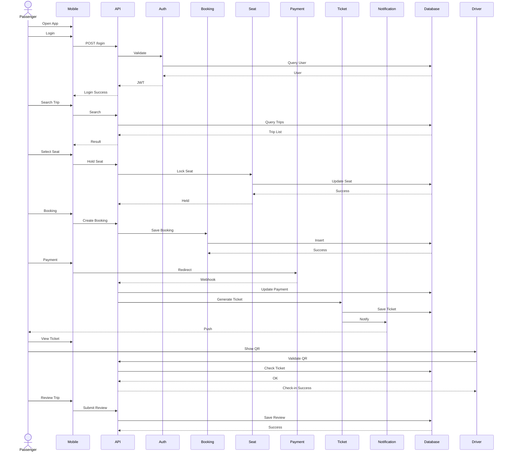

# System Sequence Diagram

Project

BusZ - Intercity Bus Ticket Booking Platform

Module

Diagrams

Document ID

DIA-020

Priority

Critical

Version

1.0

---

# 1. Purpose

System Sequence Diagram mô tả toàn bộ chuỗi tương tác của hệ thống BusZ từ lúc người dùng truy cập ứng dụng cho đến khi hoàn thành hành trình và các nghiệp vụ sau bán.

Mục tiêu

- Tổng hợp toàn bộ nghiệp vụ
- Hỗ trợ Business Analyst
- Hỗ trợ Developer
- Hỗ trợ QA
- Hỗ trợ AI Code Generation

---

# 2. Covered Business Processes

```text
Authentication

Search

Booking

Payment

Ticket

Check-in

Trip

Review

Refund

Notification

Administration
```

---

# 3. System Sequence Overview

```text
User

↓

Authentication

↓

Search

↓

Booking

↓

Payment

↓

Ticket

↓

Check-in

↓

Trip Complete

↓

Review

↓

History
```

---

# 4. Complete System Sequence



---

# 5. Authentication Sequence

```text
Login

↓

JWT

↓

Authorized API
```

---

# 6. Booking Sequence

```text
Search

↓

Seat Hold

↓

Booking

↓

Payment
```

---

# 7. Payment Sequence

```text
Payment

↓

Webhook

↓

Verification

↓

Booking Update
```

---

# 8. Ticket Sequence

```text
Payment Success

↓

Generate QR

↓

Generate PDF

↓

Notification
```

---

# 9. Check-in Sequence

```text
Scan QR

↓

Validate

↓

Update Ticket

↓

Update Booking

↓

Update Seat
```

---

# 10. Refund Sequence

```text
Cancel Booking

↓

Refund

↓

Gateway

↓

Update Status
```

---

# 11. Notification Sequence

```text
Business Event

↓

Notification

↓

Push

↓

Email

↓

SMS
```

---

# 12. Admin Sequence

```text
Dashboard

↓

CRUD

↓

Reports

↓

Audit Logs
```

---

# 13. Data Stores

```text
Users

Trips

Routes

Vehicles

Seats

Bookings

Passengers

Payments

Tickets

Reviews

Notifications

Audit Logs
```

---

# 14. External Systems

```text
VNPay

MoMo

ZaloPay

Firebase

SMTP

SMS Gateway

Google Maps
```

---

# 15. Security Flow

```text
HTTPS

↓

JWT

↓

RBAC

↓

Validation

↓

Audit Log
```

---

# 16. Error Flow

```text
Validation Error

↓

Business Error

↓

Retry

↓

Recovery
```

---

# 17. Monitoring Flow

```text
API

↓

Metrics

↓

Logs

↓

Alerts

↓

Dashboard
```

---

# 18. Business Rules

```text
Seat Hold = 10 Minutes

Booking phải thanh toán trước khi tạo Ticket.

Ticket chỉ Check-in một lần.

Refund theo chính sách.

Mọi thao tác được ghi Audit Log.
```

---

# 19. Performance Targets

```text
Login <500 ms

Search <800 ms

Booking <700 ms

Payment Callback <500 ms

Ticket Generation <1 Second

Check-in <1 Second
```

---

# 20. Acceptance Criteria

✓ Authentication Flow đầy đủ

✓ Booking Flow đầy đủ

✓ Payment Flow đầy đủ

✓ Ticket Flow đầy đủ

✓ Check-in Flow đầy đủ

✓ Refund Flow đầy đủ

✓ Notification Flow đầy đủ

✓ Mermaid Diagram hợp lệ

---

# 21. Related Documents

System Overview

Use Case Diagram

Activity Diagram

Sequence Diagram

Booking Flow

Payment Flow

Refund Flow

Check-in Flow

Notification Flow

Admin Workflow

---

# 22. Summary

System Sequence Diagram tổng hợp toàn bộ chuỗi tương tác của BusZ từ khi người dùng đăng nhập, tìm chuyến xe, đặt vé, thanh toán, phát hành vé, check-in, hoàn tiền, đánh giá chuyến đi đến các hoạt động quản trị hệ thống. Đây là sơ đồ nghiệp vụ tổng hợp quan trọng nhất trong module Diagrams và là tài liệu tham chiếu chính cho Developer, QA và AI trong quá trình triển khai hệ thống.